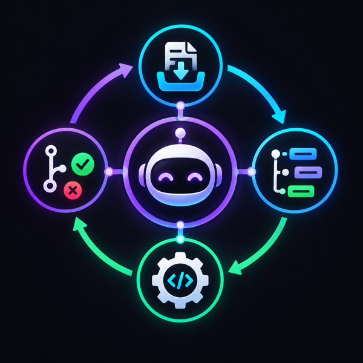

# Autonomous Engineering Worker

<p align="center">
  
</p>

> Automate the nine-to-five job hell. As one wise man said, if they don't give you a salary raise, promote yourself by working less.

An AI engineering workflow orchestrator that turns external or manually created tasks into
planned, implemented, tested, reviewed, and delivered code while deterministic software retains
control of routing, permissions, budgets, retries, and state.

The project is designed around durable jobs, isolated workers, auditable events, and
human control. AI models assist with reasoning and implementation; the application
controls scheduling, permissions, retries, and lifecycle decisions.

## Development

The application is containerized and can be started with:

```bash
cp .env.example .env
docker compose up --build
```

Read [PRODUCT.md](PRODUCT.md) for the complete product and architecture reference, and
[DEVELOPMENT.md](DEVELOPMENT.md) for setup, operations, and validation commands.
