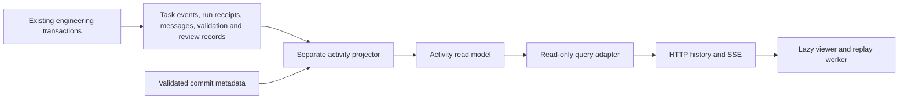

# Engineering activity replay

The dashboard, Team pages, task pages, and repository list have a **Visualize activity** button. Opening it checks the selected scope and time range. Starting the view loads recorded history; live follow is an explicit option. The viewer supports task flow, workspace groups, code changes, playback speed, timeline seeking, filters, an event inspector, resizing, maximization, and fullscreen with a viewport fallback.

This implements recorded-history replay within the existing modular monolith. It does not introduce a second workflow engine, new agents, or a generic event bus.

## Architecture and ownership

| Location                                              | Responsibility                                                                                                                                                                             |
| ----------------------------------------------------- | ------------------------------------------------------------------------------------------------------------------------------------------------------------------------------------------ |
| `backend/app/activity/domain`                         | Public activity facts, safe identifiers and paths, receipt amount semantics                                                                                                                |
| `backend/app/activity/application`                    | Scope/window values and read-query port                                                                                                                                                    |
| `backend/app/activity/infrastructure`                 | SQL read model, source projection, bounded queries, source relationships, immutable Git metadata, optional file retention                                                                  |
| `backend/app/bootstrap/activity.py`                   | Dependency composition and a dedicated small connection pool                                                                                                                               |
| `backend/app/activity_runner.py`                      | Optional projector process; no engineering scheduler or provider calls                                                                                                                     |
| `backend/app/interfaces/http/routes/visualization.py` | Input validation, existing error translation, history and SSE transport                                                                                                                    |
| `frontend/src/lib/visualization`                      | Lazy shell, API client, pure replay state, shared receipt comparisons, process/capacity metrics, plan history, inspector, range summaries, telemetry, Canvas worker, optional Gource frame |

Engineering transactions continue to write their existing durable records. The projector reads committed records in batches and writes only its own tables. Unique source identities make retries idempotent. It does not use the largest source ID as a cursor: a transaction with a lower allocated ID can commit later. Indexed anti-joins find those late records. An advisory lock used only by activity writers serializes their commits so the public sequence is safe for frozen snapshots and live resumption.

Migration `0009_activity` adds `activity_events`, `activity_file_changes`, and `activity_projection_state`. It does not alter engineering tables. Task deletion cascades to that task's activity. Migration `0010_activity_details` adds source references and explicit file collection state. Projector version 4 enriches earlier projections in bounded batches, preserving their identities and sequences; reload already-open views after upgrading. It also corrects previously misclassified GitHub check/PR notifications so they no longer inflate human review counts. Milestones remain until their owning task is deleted. Optional file-detail retention removes only derived file rows, preserving milestones, collection status, and recorded summary counts.

Migration `0011_team_capacity_history` adds Team-owned capacity audit records. Existing Teams receive a snapshot at migration time; earlier limits are unknown. Team creation and capacity updates append records in the same transaction. The existing lifecycle, Coordinator and Developer receipt transactions also retain bounded cause IDs and public work-plan snapshots. These source records have no dependency on the activity module and do not change scheduling, provider requests, budgets or decision rules.

The API uses read-only transactions and its own connection pool. Domain/application layers remain framework independent. An architecture test prevents engineering, agent runtime, Coordinator, delivery, and supervisor modules from depending on activity projection.

Projection and history queries select only the fields they consume, avoiding unused message bodies, validation output, review feedback, and repeated task descriptions. Empty history skips file and baseline lookups. Preflight computes event/task counts together over the same bounded sample.

## Replay and data semantics

Preflight freezes a maximum committed sequence. Baseline and paginated history use that same boundary. Task state comes from lifecycle records before the requested range, then transitions inside it; unavailable starting state is explicitly unknown. Playback orders by occurrence time, then sequence, so a delayed projection does not change historical chronology.

Live SSE resumes from the committed sequence, deduplicates reconnects, and catches up after a hidden tab becomes visible. A late record that changes the baseline requests a reload. Projector delay is reported on preflight and during live follow. Transport failures reconnect; oversized buffers stop with a request to narrow the view. Hiding the tab pauses playback and disconnects live transport. Closing or navigating away aborts requests, closes SSE, disconnects resize observation, and terminates the worker.

Camera and playback-control changes reuse the current task/receipt state. Seeking, new events, and filter changes rebuild it as needed. The renderer reallocates its backing canvas only when pixel dimensions change, and replacing a replay cancels its previous playback timer. Timeline, replay, and Gource export share the same chronological ordering rule.

Supported facts include lifecycle transitions, human requests/responses, Coordinator decisions, AI run starts/completions, message metadata, validation checks, review decisions, recorded job starts/finishes, incoming coordination events, merges, cost reconciliation, and collected code changes. Message bodies, prompts, arbitrary error text, source contents, and provider credentials are excluded. Task titles, project/Team names, actor labels, and repository-relative paths are visible metadata.

Receipt totals include recorded completed runs, not reservations. Unknown cost stays unknown; explicit zero remains zero. A manual cost correction replaces the run's unknown amount rather than adding a second charge. Cached input is not counted twice. Incomplete usage is marked. Cost figures describe receipts and corrections observed in the replay window, not the complete lifetime cost of every visible task. Recorded active/waiting time uses original timestamps, independent of playback speed or compressed gaps.

AI usage comparisons group the same receipts by task, current Team, recorded role and model. Run counts and provider request attempts are separate. Direct HTTP harnesses and the metered Coordinator, interpreter and Supervisor persist request counts with their existing receipts, including failed attempts and explicit zero-call recovery. Counts do not depend on whether token usage or cost is known. Claude's exposed unique assistant-response IDs provide a partial lower bound; native/internal requests that are not exposed, and older receipts without evidence, remain explicitly unknown. Corrections never create extra runs or requests. Model changes compare successive recorded run models within a task and role and make no price or capability ranking. Multi-model receipts retain their recorded model label; their combined cost is not arbitrarily divided among models.

Cause/effect arrows use recorded source IDs: incoming events → Coordinator runs → decisions/actions → lifecycle transitions → queued/started jobs, review feedback → repair transitions, human requests → replies, run completions → starts, cost corrections → receipts, work-plan snapshots → runs, and code changes → validation. New execution records retain these IDs transactionally. Missing or outside-window sources are labelled in the inspector; old records without cause IDs cannot supply the complete chain. The bounded inspector also shows linked follow-up events, checks on the same revision (separately labelled), task/Team/project context, receipts before the selected event, file retry state, and links to the task's execution details.

Work-plan dependency history shows the existing adaptive Developer's ordered units, dependency indices and observed statuses for each plan revision. Objectives, instructions and source text are excluded. It shares the execution receipt/progress channel, keeps bounded snapshots only when the public graph changes, and follows the replay playhead when seeking. Progress is sampled, so snapshot times are observation times, not exact unit-transition timestamps. Separate task-prerequisite history reads explicit engineering dependency changes, restores the baseline before the selected range, and follows seeking. Prerequisites outside the replay have unknown historical status.

Process summaries separate coding, planning, validation, delivery, review/check/human waits, blocked/paused time, unstarted time, and unknown state. They use original timestamps through the playhead. Concurrent task times add together. First-attempt job queue time is separate because it overlaps task time; retries without a recorded queue interval are unknown. Quality summaries count validation batches, unsuccessful checks, reviews, human responses, and entries into repair. “First validation” means the first observed validation in this range, not a claim about the first patch ever submitted. Code summaries report observed files/directories, languages by extension, test paths, known line counts, and frequently changed paths. Summaries use the loaded detail level and cannot reconstruct unrecorded activity.

Bottleneck percentages divide review/human/unknown time by total observed task time. Point counts show tasks awaiting people or reviews and other external blocks at the playhead. Historical capacity combines Team policy changes with recorded concurrency-slot jobs across each visible Team, including tasks outside a narrower task filter. It counts distinct concurrent tasks and reports time at/above capacity, peak concurrency, and occupied/available slot time. Policy gaps, retried jobs and truncated evidence are explicit. Job timestamps describe recorded execution spans; they cannot reconstruct missing retry attempts or all scheduler admission details. Historical evidence is frozen at preflight. Live mode replaces its bounded capacity snapshot through the existing SSE status heartbeat, approximately every ten seconds after event catch-up, including intervals with no task events. Job evidence uses the sequence already delivered to that viewer. Stale snapshots are ignored; paused or scrubbed playheads stay at their selected time. Hiding/closing the view stops the shared stream and capacity updates. Current task-to-Team attribution is used throughout.

Quality summaries distinguish local validation, external CI and human intervention. CI observations are recorded transactionally from incoming GitHub check runs, suites and commit statuses, without extra provider calls. They retain the observed commit SHA, outcome and an opaque execution/context key, excluding check names, URLs and output. Failed check executions/status contexts are deduplicated within each task and revision; suites are counted separately to avoid adding an aggregate suite result to its individual checks. Cancellation and pending states are not failures. Legacy notifications without outcome evidence are marked incomplete. Human code intervention counts use explicit manual-takeover transitions and distinct tasks, excluding repeated takeover while already held; source edits are never inferred from a takeover or comment.

Scope access follows the application's existing deployment/operator authorization. Workspace means this installation; project scope groups the existing `Task.project_name` values. Team/project labels and repository associations use current task metadata. These are not tenant boundaries or historical ownership snapshots.

## Code view

The collector reads name/status and line-count metadata from validated commits in the configured workspace root. It uses fixed Git arguments, no shell, bounded output/time, and a read-only volume. File changes and their event are stored together. Unavailable workspaces/commits are retried without holding up other projected milestones. Only the primary validated repository is collected where that is all the execution record identifies.

The code renderer uses canonical file-change rows. It also exports a native Gource custom log, converting renames to delete/add records. **Open Gource replay** starts an optional WebAssembly renderer from the same frozen file log. Its assets load only on request, in a separate same-origin frame; returning, closing, or a renderer failure removes the frame. Hidden tabs pause its main loop. Canvas playback/live transport pause while Gource is open and the original timeline position is preserved on return. Gource has independent historical playback, not synchronized live/timeline controls.

The [Gource Web engine](https://github.com/Posnet/gource-web) is pinned and self-hosted with its license, corresponding source archive and checksums in `frontend/static/gource/vendor`. The project supplies only the metadata log: it does not embed the upstream cloning/authentication/proxy UI. No GitHub login or external asset host is required. The renderer needs browser WebGL2/WASM and has its own runtime memory; unsupported or failed rendering offers a return to Canvas. See [the vendor notes](../frontend/static/gource/README.md) for provenance and updating.

This is observed validated-commit activity, not a complete Git history or a recording of uncommitted edits, file reads, or keystrokes. Old commits must still be available to backfill their metadata. Preflight and live status report collected, pending, unavailable, oversized, unreadable, and expired file history, including when collection is disabled. Missing workspaces/commits retry with bounded exponential backoff (one minute to one hour). Commits exceeding 200 files or the output bound are terminally marked oversized rather than retried indefinitely. Timeouts remain retryable. The code view explicitly remains incomplete in these cases. The graph draws up to 250 touched files, while the inspector and export retain the loaded bounded metadata.

## Configuration and operation

Normal Compose builds include a separate `activity` service. Production and execution overlays include it too. The API image already contains Git; no additional package or service is required. Compose waits for the API migration/health check before starting projection. When running processes directly, apply the normal migrations and run `python -m app.activity_runner` from `backend` alongside the API.

| Setting                        | Default | Purpose                                                                                    |
| ------------------------------ | ------- | ------------------------------------------------------------------------------------------ |
| `ACTIVITY_ENABLED`             | `true`  | Enables API access and the projector loop                                                  |
| `ACTIVITY_COLLECT_FILES`       | `true`  | Enables validated-commit metadata collection                                               |
| `ACTIVITY_FILE_RETENTION_DAYS` | `0`     | Zero preserves file detail; positive values expire old derived file rows in batches of 100 |
| `ACTIVITY_POLL_SECONDS`        | `5`     | Delay between projection batches                                                           |
| `ACTIVITY_MAX_EVENTS`          | `5000`  | Maximum events loaded into one viewer                                                      |
| `ACTIVITY_MAX_FILES`           | `5000`  | Maximum file-change rows loaded into one viewer                                            |
| `ACTIVITY_MAX_TASKS`           | `200`   | Maximum tasks in one viewer                                                                |
| `ACTIVITY_MAX_REPLAY_DAYS`     | `90`    | Maximum requested historical range                                                         |

Set `ACTIVITY_ENABLED=false` for both API and projector to disable the module; existing engineering processing remains functional. The launcher reports that visualization is disabled if opened. No render worker or visualization request is created merely by visiting the dashboard.

The projector has a 256 MiB/0.25 CPU Compose limit, a two-connection pool, no pool overflow, bounded SQL/lock waits, no Docker socket, and no provider credentials. Its workspace mount is read-only. The API uses a separate two-connection activity pool. This isolates the execution path, but projection and viewing still consume finite database/browser resources. Larger installations should measure query latency before increasing limits; oversized ranges offer a UTC hourly/daily summary without loading raw events or starting a renderer. The aggregate query returns at most 366 daily or 169 hourly buckets within the configured time range, shares the frozen sequence and scope rules, and retains the two-second SQL timeout. Selecting a bucket narrows the replay range. Aggregates provide event/task/validation/review/response counts; precise lifecycle duration and receipt analysis remains in bounded replay.

Stop the activity service along with other writers during an operationally quiescent backup/restore. The new tables are included in normal database backups. Rebuilding them is possible from retained source records, but purging history is an operator maintenance action and is not part of normal startup. Missing file history cannot be recreated after its workspace/commit has been removed.

## Viewer monitoring

The existing Prometheus endpoint exports activity query latency/errors, returned event counts, active/resumed SSE streams, and projector lag refreshed at scrape time (-1 when unavailable). Browser reports include first-frame initialization time, measured Canvas frame processing/drawing time, redraw counts, reconnects, worker crashes, graphics/Gource failures, and observed session duration. Rendering is event-driven; these are actual redraw measurements, not a claimed continuous FPS rate. Reports are bounded numeric deltas with no task IDs, messages, or arbitrary labels. Best-effort delivery failures never interrupt playback. Timers and streams are disposed with the viewer; no browser monitoring runs before it starts.

## Local verification and limits

Local tests cover late/out-of-order commits, concurrent idempotent projection, frozen history, correct baselines, read-only queries, scope and size validation, metadata privacy, Git rename/binary parsing, immutable file reads, cost reconciliation, projector failure independence, actual browser worker rendering, live resumption, buffer limits, graphics fallback, source relationship resolution, scoped/fenced inspection, range summary drill-down, retention without recollection, bounded telemetry, and resource cleanup. Migration tests compare the upgraded schema to the models and preserve existing data. Browser APIs are mocked; no paid execution or live deployment is involved.

Tests also cover historical capacity changes with Team-wide execution evidence, live snapshot sequence fences and pause/resume, work-plan privacy/deduplication, explicit review/repair/job links, request counts independent of usage completeness, CI identity/privacy and notification reclassification, manual takeover summaries, backward dependency replay, and loading/failing/disposing the real self-hosted Gource engine. Backend/provider APIs are mocked in browser scenarios.

Historical dependencies, capacity and exact causal steps absent from source records cannot be reconstructed reliably. Deployment outcomes do not establish production incidents or a DORA change-failure rate. No production load, live provider, or deployment verification is claimed.

## Task prerequisites and deployment observations

Migration `0012_task_dependencies` adds explicit prerequisites owned by Engineering. The task page can add/remove at most 32 prerequisites while the task is new or paused and no execution remains in flight. Saves compare the previous prerequisite set, reject missing tasks/self-links/cycles, and commit the graph and audit event together. A short existing admission lock serializes dependency edits with scheduler claims; recursive cycle checks visit each reachable task once and have a SQL deadline. Unmet prerequisites consume no engineering slots. A queued task becomes eligible when every prerequisite is `MERGED`, subject to all existing capacity, pause and enrollment rules. Cancellation/failure of a prerequisite keeps its dependent blocked. Paused tasks never resume automatically. Tasks without prerequisites keep their existing execution path. The queue has a dedicated prerequisite wait lane, task responses include batched prerequisite status, and the Coordinator receives prerequisite facts only when configured.

`PUT /api/tasks/{task_id}/dependencies` accepts `dependency_ids` and `expected_dependency_ids`. Conflicting changes return 409; missing tasks return 404. Task reads include each prerequisite's ID, title and status. These controls use the same installation/operator access as existing task controls; they do not grant the Coordinator dependency-editing authority.

Migration `0013_deployment_observations` adds Delivery-owned immutable observations from the existing verified GitHub webhook inbox. `deployment` and `deployment_status` deliveries record a bounded environment name, SHA, provider identities, outcome, timestamps and explicit production flag. Unknown flags remain unknown. Provider payloads, URLs, credentials, descriptions and logs never enter the public observation. Stable repository/deployment/status identities deduplicate retries; occurrence timestamps preserve provider chronology even when deliveries arrive out of order. No deployment, merge, provider polling or model call is triggered by an observation.

Repositories now have an on-demand **Deployment history** panel with repository/range/production filters. `GET /api/deployments?start=...&end=...&repository_id=...` reads up to 2,000 observations over at most 90 days, with a two-second query timeout and an explicit truncation result. Closing the panel cancels its outstanding request; it adds no background poller. The panel retains observations without task matches. Activity replay projects observations matched by an explicitly recorded repository and head/merge SHA; it can associate an earlier deployment after merge evidence arrives. Reconciliation now preserves the remote merge SHA in an idempotent observation even when the original merge response was lost. Associations do not infer commit ancestry.

The repository panel and replay share one metric implementation. They count distinct deployments with observed success/failure, time from creation to first success, and failure to the next success in the same repository/environment. A deployment may appear in both outcome counts. Retry deliveries and multiple task associations do not multiply outcomes. Metrics describe the selected observations; omitted prior events and truncated ranges remain incomplete. No incident, change-failure rate or lead time from source commit is invented.

Existing GitHub webhooks must deliver the two deployment event types to populate this history. GitHub Apps require read access to Deployments, and GitHub does not send deployment-status webhooks for the inactive state. See the [GitHub webhook contract](https://docs.github.com/en/webhooks/webhook-events-and-payloads#deployment_status). External webhook configuration and production activation were not changed.

The installed Codex SDK contains a raw-response schema type, but its notification registry does not expose that event through the adapter's turn stream. Its exact request count therefore remains unavailable. No speculative count is derived from token updates or tool calls, and no SDK upgrade or extra inference is required by these changes.
