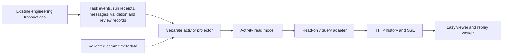

# Architecture and workflow

[Setup and development](guide.md) · [Evaluation and results](evaluation.md)

The unified product and architecture reference: how the application is built, how tasks reach Git, and where authority lives. Capabilities described here still require deployment-specific configuration and acceptance.

## 1. What this project is

Autonomous Engineering Worker is a self-hosted engineering control plane. An operator connects repositories and work sources, configures Teams and runtime policies, and authorizes tasks. The system coordinates coding sessions, validates the resulting changes, publishes a GitHub pull request, and conditionally merges it only when the delivery policy permits.

The important distinction is between **decision-making** and **authority**. An AI may interpret a request, propose a plan, edit files, or explain operational facts. It cannot make its own output equivalent to a valid lease, a paid-work reservation, a passing deterministic validation, or a human approval.

There is one fixed engineering lifecycle. This is not a generic user-programmable workflow graph, and the lifecycle visualization is not a separate workflow engine.

The best description of the architecture is a **modular monolith with several process roles and isolated execution containers**:

- Modules share a Python codebase and PostgreSQL schema.
- API serving, execution scheduling, activity projection, and supporting background work have separate runtime entry points or controller loops.
- Paid native turns, validation, and Git transport run in containers with different capabilities.
- The web frontend is a separate SvelteKit application.
- The desktop application wraps the web frontend; it does not implement a second business backend.

This avoids the operational overhead of microservices while retaining module boundaries and separate execution isolation. It is not yet a fully decoupled system: several infrastructure adapters import other modules' infrastructure, and the architecture guard explicitly acknowledges those existing dependencies.

## 2. Technology stack and layout

### Backend

| Technology                             | Role in this repository                                                                                              |
| -------------------------------------- | -------------------------------------------------------------------------------------------------------------------- |
| Python 3.12+                           | Application, domain rules, controller processes, and runner implementation.                                          |
| FastAPI and Uvicorn                    | HTTP routing, request validation integration, OpenAPI, and ASGI serving.                                             |
| Pydantic / pydantic-settings           | Request/configuration models, bounds, and environment parsing.                                                       |
| SQLAlchemy 2 async                     | Database adapters, transaction ownership, queries, row/advisory locking.                                             |
| PostgreSQL                             | Durable task state, jobs/leases, receipts, configuration, histories, and projections. Compose targets PostgreSQL 16. |
| asyncpg / psycopg                      | Async application access and synchronous database/migration access respectively.                                     |
| Alembic                                | Ordered schema migrations. The current patch adds revision `0014_task_creation_requests`.                            |
| asyncio / AnyIO / HTTPX                | Bounded background work, cancellation, HTTP integrations, and Docker API transport.                                  |
| cryptography                           | Integration-credential encryption support.                                                                           |
| structlog / prometheus-client / psutil | Structured logging, metrics, and host/resource observations.                                                         |
| tree-sitter grammars                   | Source structure analysis used by repository/context tooling.                                                        |
| Native harness extras                  | Locked Codex and Claude SDK dependencies for runner images; not required as API-process model executors.             |
| uv, Ruff, mypy, pytest                 | Locked dependency installation, lint/format, strict type checks, and tests.                                          |

Declared dependency ranges live in `backend/pyproject.toml`; the reproducible dependency resolution lives in `backend/uv.lock`. Do not treat a range in the manifest as the exact installed version. The Python package version and HTTP app version currently differ (`0.1.0` versus `2.2.0`); neither is a database migration number or an `/api/vN` prefix.

### Frontend and desktop

| Technology                                  | Role                                                                                          |
| ------------------------------------------- | --------------------------------------------------------------------------------------------- |
| TypeScript, Svelte 5, SvelteKit 2           | Typed client logic, reactive UI, filesystem routes, and Node application output.              |
| Vite 6 and adapter-node                     | Development server, production bundling, and Node server adapter.                             |
| Tailwind CSS 4 and component CSS            | Shared styling utilities plus scoped component presentation.                                  |
| ECharts                                     | Operational and analytical charts.                                                            |
| `@xyflow/svelte`                            | Lifecycle/graph presentation. It does not define backend execution authority.                 |
| Canvas, Web Workers, optional Gource viewer | Activity rendering/replay, computation off the main thread, and optional alternate rendering. |
| EventSource and streaming fetch             | Lifecycle/activity notifications and streamed assistant answers.                              |
| Vitest and Playwright                       | Unit tests and browser flows; ESLint, Prettier and svelte-check provide code checks.          |
| Rust / Tauri 2                              | Local desktop launcher and webview shell.                                                     |

`frontend/package.json` requires Node >=22.13; Docker builds use Node 22. JavaScript locks are in `package-lock.json`; Rust uses `desktop/src-tauri/Cargo.lock`. Inspect those locks before changing dependencies rather than relying on a report's version list.

### Top-level map

| Directory/file             | Purpose                                                                                                    |
| -------------------------- | ---------------------------------------------------------------------------------------------------------- |
| `backend/app`              | Python application modules and process entry points.                                                       |
| `backend/migrations`       | Alembic environment and ordered schema revisions.                                                          |
| `backend/tests`            | Domain, application, architecture, adapter, HTTP, and database regressions.                                |
| `frontend/src/routes`      | Dashboard, tasks, Teams, repositories, integrations, settings.                                             |
| `frontend/src/lib`         | Typed services, UI components, state/helpers, Observer, and visualization.                                 |
| `frontend/tests`           | Browser regressions and mocked API flows.                                                                  |
| `desktop`                  | Tauri project and local loading/error UI.                                                                  |
| `deploy`                   | Production/execution/monitoring Compose overlays, proxy configuration, images, backup and restore tooling. |
| `monitoring`               | Prometheus/exporter/alerting configuration.                                                                |
| `scripts`                  | Local startup, real-workflow verification, observability checks, and credential rotation.                  |
| `docs`                     | Architecture, setup/development and evaluation references.                                                 |
| `compose.yaml`, `Makefile` | Local base stack and common developer commands.                                                            |
| `.runtime`                 | Local working artifacts; not an authoritative application module.                                          |

## 3. Processes, startup, and deployment modes

### Main process roles

**HTTP API — `backend/app/main.py`:** registers routers, configures logging/CORS, emits request IDs and request metrics, and opens/closes supporting resources through an ASGI lifespan. It can instantiate a scheduler if configured, but base Compose disables that in the API service. The API Docker entry point runs `alembic upgrade head` before Uvicorn.

**Execution controller — `backend/app/scheduler_runner.py`:** starts the scheduler when enabled and runs supporting observability, Observer, and Coordinator controllers. When the scheduler is disabled, it waits rather than repeatedly exiting/restarting. Supporting controllers have their own configuration gates; disabling phase scheduling is not a universal shutdown of every background feature.

**Activity projector — `backend/app/activity_runner.py`:** maintains activity read models independently of the paid execution loop. The execution overlay gives it read-only workspace access for permitted file evidence. Its API/query pool is deliberately small and has short query/lock timeouts.

**Ephemeral runners:** Developer, validator and Git-transport containers are launched for specific operations. They are not normal always-running frontend/API services. The `developer-image` Compose service is an image-building facility, not a permanently active coding agent.

**Frontend:** production builds run through the Node adapter on port 3000. `frontend/src/hooks.server.ts` provides the same-origin `/api` proxy when `API_URL` is supplied. In production, Caddy routes API and UI traffic.

**Desktop:** `desktop/src-tauri/src/lib.rs` resolves the repository root, invokes the shared shell launcher, waits for the UI port, and opens the web console. Startup failure stays visible in the shell. Closing the webview does not stop the Compose stack.

### Local modes

Configure the ignored `.env` from `.env.example` first, including synchronized database URLs, a real application secret, and the required GitHub App mount/configuration. Do not overwrite an existing deployment `.env` with examples.

```sh
sh scripts/start-local.sh --mode console
sh scripts/start-local.sh --mode execution
sh scripts/start-local.sh --mode full
```

| Mode        | Compose selection                                                             | Meaning                                                                           |
| ----------- | ----------------------------------------------------------------------------- | --------------------------------------------------------------------------------- |
| `console`   | `compose.yaml`                                                                | Base application services; phase scheduler is disabled in the base configuration. |
| `execution` | Base + `deploy/compose.execution.yaml`                                        | Adds native execution infrastructure and related runtime environment.             |
| `full`      | Execution + observability + alerts; macOS monitoring overlay where applicable | Execution-capable stack with monitoring services.                                 |

Selecting execution/full does **not** bypass `SCHEDULER_ENABLED`, harness flags, credentials, Team budgets, repository grants, validation configuration, or automation policy. With those enabled it can resume already authorized queued work. Selecting console is also not a global kill switch for another running controller deployment.

The standalone script defaults to `full` to preserve its previous behavior. Desktop defaults to `console`, and explicitly uses `--no-build`. Normal script startup builds; `--no-build` reuses images and cannot deploy source edits. `AEW_START_MODE` chooses a default, and `AEW_REPO_ROOT` locates a checkout for packaged desktop builds.

For source development, install backend dependencies with `uv sync --locked --all-extras` from `backend` and frontend dependencies with `npm ci` from `frontend`. Run `make dev-backend` and `make dev-frontend` in separate terminals. The frontend Make target points its proxy at localhost:8000. Backend host-run database settings must reference an actually reachable PostgreSQL instance; the base Compose database is private and its container hostname is not a host-machine DSN.

Production uses `deploy/compose.production.yaml` as its base, not the local shell launcher. Add overlays deliberately and follow the production environment/secret/network setup in the [setup guide](guide.md) and `deploy`. A local console startup is not evidence of a production-secure deployment.

## 4. Backend layering and module ownership

The intended direction is: **HTTP/composition → application use cases and ports → domain rules**, with infrastructure implementing persistence and external capabilities. Python Protocols express ports; the bootstrap layer selects concrete adapters.

- `domain`: state transitions, policy decisions, value objects and other rules that should be testable without HTTP, SQL, Docker, or a provider account.
- `application`: orchestration and contracts for work such as creation, queries, lifecycle changes, and executing a leased phase.
- `infrastructure`: SQLAlchemy records, SQL queries, provider clients, container adapters, and persistence-aware workflows.
- `interfaces/http`: validates/serializes public input and output and translates known failures into HTTP responses.
- `bootstrap`: constructs the actual runtime dependency graph and process/controller resources.

| Module          | Owns                                                                                                                   | Important boundary                                                                                       |
| --------------- | ---------------------------------------------------------------------------------------------------------------------- | -------------------------------------------------------------------------------------------------------- |
| `engineering`   | Tasks, requirements, dependencies, lifecycle, leased phases, validation and user controls.                             | Canonical work state; an external comment or model response is not automatically a permitted transition. |
| `teams`         | Assignment, native profiles, automation policy, capacity, pause/wake.                                                  | An enrolled native session retains explicit ownership.                                                   |
| `repositories`  | Repository inventory, scope, runtime images and validation commands.                                                   | A connected provider account does not automatically grant every Team every repository.                   |
| `intake`        | Signed delivery ingestion, provider snapshots, reconciliation and interpretation.                                      | Converts external events into canonical evidence/work without trusting them as execution authority.      |
| `agent_runtime` | Harness adapters, prepared sessions, manifests, accounting, context management, bounded editing and runner isolation.  | Model/tool activity is metered and bounded, distinct from deterministic delivery.                        |
| `coordinator`   | Event-driven conversation decisions, clarification and persisted actions/effects.                                      | Modes and explicit authorization constrain its actions.                                                  |
| `supervisor`    | Bounded supervision and execution guidance.                                                                            | Advice/stop decisions do not create merge authority or unlimited paid retries.                           |
| `delivery`      | Git transport, PR publication, review evidence, conditional merge, status synchronization and deployment observations. | GitHub facts and policy are rechecked against the validated revision.                                    |
| `analytics`     | Historical facts, efficiency/cost calculations and forecasts.                                                          | Missing/incomplete usage must not become invented cost savings.                                          |
| `observability` | Infrastructure health, resource attribution, incidents and read-oriented Observer assistance.                          | Operational explanations do not mutate task execution.                                                   |
| `activity`      | Replay projection, file-change evidence, bounded visualization queries.                                                | An eventually updated read model, not the execution source of truth.                                     |
| `platform`      | Settings, sessions, security helpers, integration plumbing, scheduling support and telemetry.                          | Shared mechanisms, not a catch-all for every business rule.                                              |

The repository's architecture tests protect pure layers and record existing cross-module infrastructure relationships. They prevent introducing new private dependency pairs silently; they do not prove complete decoupling or remove historical cycles. This is a practical starting point for adding modules, not a finished textbook Clean Architecture implementation.

## 5. Data, transactions, and durable evidence

PostgreSQL is the durable coordination system; there is no Redis/Celery job broker in this deployment design. SQLAlchemy async sessions are short-lived units of database work, created from configured session factories. The main factory uses connection-pool bounds and pre-ping; supporting subsystems can use separately bounded pools.

| Data family             | Representative records                                                                                                                | Why it exists                                                                |
| ----------------------- | ------------------------------------------------------------------------------------------------------------------------------------- | ---------------------------------------------------------------------------- |
| Work                    | `tasks`, `task_dependencies`, `task_repository_scopes`                                                                                | Current status, requirements, scope and prerequisite relationships.          |
| Creation identity       | `task_creation_requests`                                                                                                              | Same-request creation retries resolve to one task.                           |
| Execution history       | `jobs`, `task_events`, `task_phase_runs`                                                                                              | Dispatch, leases, lifecycle evidence and history.                            |
| Native execution        | `developer_sessions`, `ai_runs`, context generations/checkpoints/token policies                                                       | Session identity, usage/cost, continuation and interruption evidence.        |
| Validation/review       | `validation_runs`, `review_cycles`                                                                                                    | Revision-specific proof and subsequent feedback.                             |
| Ownership/configuration | Teams, assignments, profiles, automation, repository runtime profiles, integrations and settings                                      | Who may run what, with which runtime and limits.                             |
| External input/output   | Webhook deliveries, external task snapshots, external status synchronization, task messages                                           | Deduplication, reconciliation and durable conversations/effects.             |
| Coordinator             | Events, runs, actions, human requests                                                                                                 | Decisions and effect execution can be inspected and recovered independently. |
| Read models             | Activity events/file changes/projection state, forecasts, resource summaries, incidents, Observer history and deployment observations | Operator insight without making a browser read the execution authority.      |

`app/platform/persistence/registry.py` imports model modules to register cross-module metadata; model definitions live with their owning adapters. `task_creation_requests` is registered through the task-model module even though the registry need not export each class by name.

Key concurrency mechanisms are lifecycle/requirement versions, job lease tokens/expiry, row locks, advisory locks, unique identities, and guarded state transitions. They solve different problems: a request ID prevents duplicate creation, while a valid job lease authorizes a particular execution attempt. Neither substitutes for the other.

The application is not purely event-sourced. Current state is persisted in task/session/configuration rows alongside histories and projections. Do not assume deleting/rebuilding one projection reconstructs every authoritative database object.

## 6. Complete workflow: task → files → commit → push → PR → merge

### 6.1 Receive and create work

Manual creation starts in `frontend/src/routes/tasks/+page.svelte`, through the typed task service to `POST /api/tasks`. A draft is free by default. The form sends the selected Team, optional start intent, and retry UUID in one request.

`CreateTask` owns the transaction: validate/create domain task, persist it, assign the chosen Team, add the creation event, optionally request execution, remember the retry identity, and commit. Assignment errors roll back the whole operation. Reusing the same UUID with changed details returns 409; identical retries return the existing task without another start request. The browser keeps that identity in memory after failure, not across a full browser restart.

A PostgreSQL transaction advisory lock serializes identical request IDs. Deleting a task cascades away its retry record; this is not a permanent tombstone or cross-tenant idempotency design. An explicitly chosen Team is not replaced by automatic routing. Old API clients can omit `team_id` and `request_id`.

External sources enter through signed webhooks and/or reconciliation, using their own persisted provider delivery/snapshot identities. Linear, Trello, GitHub and Slack do not all have identical workflows or configuration. Integration-specific adapters normalize their evidence before canonical task work occurs. Never treat the manual-creation request ID as universal webhook deduplication.

### 6.2 Enroll a Team-owned execution session

`engineering/infrastructure/job_queue.py:request_execution` calls enrollment within a nested transaction. A configuration problem records an actionable waiting state/event rather than silently launching an incomplete runner.

`enrollment.py` verifies Team/repository availability, enrollment policy and scope, eligible task state, absence of conflicting work, an enabled supported Developer profile, an explicit budget, and safe unused paths. It then persists the native session and enqueues the intake phase.

An enrolled task uses branch `agent/task-<task UUID>`, a task-local repository under `WORKSPACE_ROOT/tasks/<UUID>/repository`, and separate native state/control roots. Existing unregistered directories require inspection rather than automatic overwrite. Provider, harness/model identity, requirement revision and workspace ownership are retained for later checks.

### 6.3 Claim a phase, not an unbounded AI loop

The scheduler has separate dispatch, integration-polling and heartbeat activities. Before new work, it recovers lost leases/receipts. Claiming respects runnable task state, manual takeover, archive flags, dependencies, Team availability, global/Team capacity and retry timing.

Claims use database coordination including row locks with `SKIP LOCKED` and admission/Team-scoped locks. The application wrapper revalidates the lease before execution and watches heartbeats while the phase runs. Revoked or unverifiable authority interrupts the operation rather than permitting spending to continue indefinitely.

Deterministic validation/publication/merge are not all charged against the same Team developer-slot category. Global process concurrency, Developer capacity and validation capacity are separate controls.

### 6.4 Understand status, stage and reason separately

`TaskStatus` answers whether work is runnable, waiting, suspended or terminal: `NEW`, `ACTIVE`, `WAITING_EXTERNAL`, `WAITING_HUMAN`, `PAUSED`, `FAILED`, `CANCELLED`, `MERGED`.

`Stage` answers where it is: `INTAKE`, `PLANNING`, `DEVELOPING`, `VALIDATING`, `PUBLISHING`, `REVIEWING`, `FIXING`, `MERGING`, `COMPLETE`.

`WaitReason` explains why progress stopped, for example configuration, budget, token limit, no progress, provider outage, approval, GitHub review/checks or merge conflict. Preserve these distinctions in new modules and UI; one “running/done” flag loses essential operational information.

The usual path is intake → developing → validating → publishing → reviewing → merging → complete. Planning is conditional. Failed checks or review feedback can return to fixing. Merge recheck returns to review. Pauses retain the stage; requirement revision invalidates stale evidence. Terminal tasks are not implicitly reopened, and manual takeover requires explicit release.

### 6.5 Prepare the repository

The intake executor prepares verified directories and runs the Git transport in its dedicated environment. Preparation refuses to overwrite a nonempty workspace, initializes the task branch, fetches the base branch and checks it out. Credentials/remotes are not persisted in the task's Git config. The resulting base/head SHA is recorded only after checking the task's lifecycle version.

### 6.6 Run the Developer

`SqlPhaseExecutor` dispatches the leased phase. The refactored implementation makes its prerequisites explicit:

- `phase_context.py` loads task/session/profile/Team/repository and effective pricing/token policy and rejects mismatched native profile identity.
- `development_setup.py` checks enabled harnesses, credentials, prices, consumed budget and available reservation, then builds the runner manifest.
- `developer_request.py` assembles the authoritative requirement, current feedback, repair evidence, handoff/checkpoint context and Coordinator delta. Stale revision/SHA handoffs remain blocked.
- `DockerHarness` transports the manifest, mounts, allowed provider environment, progress and supervision callbacks into the native runtime.
- `DevelopTask` orchestrates metered session start/resume, run recording, receipt persistence and checkpoint work.

The controller still decides candidate-validation handoff, bounded repair, continuation acknowledgement, compaction and rollover in the original order. Compaction/continuation are distinct metered operations; they do not share an unlimited reservation. A failed native result is classified by `developer_failures.py`; it is not treated as successful implementation because some files changed.

Codex, Claude, Responses and bounded patch harnesses have different capabilities. In particular, the execution path rejects native-style compaction/rollover requests for Responses/patch rather than pretending they have an equivalent persistent native session.

### 6.7 Deterministic validation and the local commit

`validation_phase.py` selects the repository runtime's validation commands/images, verifies any candidate handoff evidence, and launches the validator. Commands are explicit argv rather than a browser-supplied arbitrary workflow.

`validator_runner.py` is the key answer to **“when does it commit?”**:

1. Require the dedicated non-root container and `/workspace`; reject database, application, AI and GitHub credentials.
2. Verify the expected task branch and fingerprint the candidate files.
3. Run the configured deterministic checks with timeout and bounded output.
4. Reject a nominally passing run if validation itself changed repository files.
5. If checks pass and the worktree is dirty, stage changes and create the local commit using the configured Team author and publication title.
6. Return the exact resulting HEAD SHA, fingerprint, per-command results and bounded change summary.

A native harness may already have created commits; the deterministic validator does not create a redundant commit if the worktree is clean. The important guarantee is that delivery uses recorded successful validation for the **actual current SHA and requirement version**, not the agent's narrative claim.

Validation results persist as per-check evidence. Failures retain bounded feedback and fingerprints for no-progress/repair handling. Optional Reviewer consultation does not replace deterministic checks or GitHub authorization.

### 6.8 Push the validated SHA and publish a PR

`delivery/infrastructure/publication.py` obtains the delivery gate and a short-lived GitHub credential, then runs the publisher against the validated revision.

`git_runner.py` does not push arbitrary dirty work. It requires the expected SHA, copies permitted Git objects into a fresh temporary bare repository, checks the commit/object database, then performs a normal push of that SHA to the task branch. It does not force-push. This separates publication from untrusted repository-local configuration and hooks.

The GitHub adapter creates/reuses/updates PR publication as appropriate and verifies the expected revision. Only after the external operation does the controller persist the PR number/URL under a lifecycle-version check. A stale task during publication produces an inspection/reconciliation failure; external push and database commit are not one atomic distributed transaction.

Therefore these are different milestones: **files changed**, **local commit created**, **branch pushed**, **PR recorded**, **merge confirmed**. The UI/reporting must not collapse them into one “done” event.

### 6.9 Review and guarded merge

Publication transitions into external review waiting. Provider events/reconciliation bring in review messages and checks. Accepted feedback can schedule fixing; policy-authorized progress can schedule merge.

`delivery/infrastructure/workflow.py:merge_phase` rechecks task/job lease identity and expiry, task/Team controls, PR/head, current validation and review evidence, repository allowlist, required checks and approval policy. It conditionally merges the expected SHA, not whatever happens to be the branch head later.

If the same PR head was already merged, recovery observes that result instead of blindly submitting another mutation. If conditions are not yet met, the phase records blockers and returns a merge recheck. Database locks currently span bounded GitHub evidence/merge work in this final gate; shortening that transaction safely requires a separately designed concurrency/recovery change.

Finally, lifecycle/history and external status synchronization record the outcome. Deployment observations are separate evidence about deployment; merged code is not proof of successful production rollout.

## 7. AI roles, conversation, and spending

**Developer:** performs authorized engineering work with explicit runtime/profile/budget settings and persisted native execution evidence.

**Thinker/Reviewer:** optional native consultations. They require supported harness behavior and a configured budget. They do not run as a universal mandatory sequence for every task.

**Coordinator:** processes canonical conversation/events and persists decisions, human clarification and actions. Modes are `off`, `shadow`, `active`; inspect the mode semantics and per-action authority before enabling it. Decisions and effect processing have separate controller loops. It is not another free-running Developer scheduler.

**Supervisor:** optionally assesses bounded evidence and emits guidance or a stop decision. Its allowance must fit alongside Developer work. The controller distinguishes supervisor availability failure from permission to continue spending.

**Observer/Jarvis:** operational assistant built around product facts and saved conversations. Deterministic responses remain available without a local model; optional Ollama explanation is gated by settings, capacity and bounded requests. It is not a paid cloud fallback, does not edit source, and does not gain task-execution authority from the chat UI. Acknowledging/snoozing attention items affects attention state, not code execution.

Price catalog, usage receipts, reservations and calculated costs are separate concepts. Admission rejects incomplete/exhausted accounting rather than assuming unknown usage is free. Context generation/checkpoint and handoff information is versioned so a session cannot silently inherit different requirements or provider/model identity. Provider limits, token limits, no-progress detection and bounded repair are product safety mechanisms, not formatting details to remove during cleanup.

## 8. Frontend architecture and data flow

The route components assemble feature views; `src/lib/services` holds typed API operations and `src/lib/api.ts` centralizes fetch/error behavior. The API helper does not automatically retry mutations. It shows bounded human-readable FastAPI errors instead of raw submitted validation input or proxy HTML and retains the request ID for diagnostics.

| Route                   | Main responsibility                                                                            |
| ----------------------- | ---------------------------------------------------------------------------------------------- |
| `/`                     | Control-center dashboard, throughput, usage, active work and host/operational summaries.       |
| `/tasks`                | Filter/sort, board/list, cursor navigation and atomic task creation.                           |
| `/tasks/[id]`           | Requirements, conversation, controls, session/run/validation/review/resource/history evidence. |
| `/teams`, `/teams/[id]` | Team management, assignment/capacity, profiles, automation and lifecycle presentation.         |
| `/repositories`         | Repository discovery/configuration and runtime/validation readiness.                           |
| `/integrations`         | Provider connection, verification, saved configuration and source destinations.                |
| `/settings`             | Operator preferences, display/locale and monitoring/assistant settings.                        |

Svelte runes (`$state`, `$derived`, `$effect`) express reactive state. Helpers such as `createLatestRequest` and `createLiveRefresh` prevent stale responses or bursts of events from overwriting newer user actions unnecessarily.

`services/task-updates.ts` shares one task-event connection and polling timer among its subscribers. This is not a claim that the entire application has only one connection: the dashboard, activity viewer and assistant transports have specialized lifecycles. On disconnect, visible views reconcile through reads; SSE is not the durable source of task state.

Task-list pagination is keyset-based with a stable UUID tie-breaker. `GET /api/tasks` remains an array and returns `X-Next-Cursor` when another page exists. The board counts/cards describe the currently loaded page, not a newly invented exact database-wide total. This is live navigation, not a repeatable snapshot: mutable sort values can move tasks between pages.

Priority, created, updated and due sorting preserve deterministic tie-breakers and null handling. Invalid cursors or changed-filter reuse return 422. Cursors are navigation hints, not authorization tokens. API failures expose bounded messages and a request ID without echoing submitted validation values or proxy HTML; mutations are not automatically retried.

### Observer readability boundary

- `ObserverShell.svelte`: mounted lifecycle, configuration/status polling, viewport/dock positioning, dialog visibility and notifications.
- `conversation.svelte.ts`: reactive chat state, streaming answers, cancellation/reset and saved conversation loading.
- `ObserverPanelContent.svelte`: history/attention/welcome/message/composer presentation and user-facing attention/preferences actions.
- Existing `api.ts`, `messages.ts`, `position.ts` and `draggable.ts`: transport, reply/source handling, geometry and interactions.

Closing the panel is not resetting a chat. The state stays in its controller, while UI nodes mount/unmount. API activity and paid-work authority remain separate.

## 9. Activity replay, analytics, and monitoring

### Activity replay

The projector translates operational evidence into bounded replay records with sequence numbers, causality and file coverage information. Consumers can be delayed behind execution; the UI explicitly represents delayed, incomplete and sampled history rather than inventing missing file changes.

The viewer preflights a scope/time window, estimates bounds and offers aggregate narrowing when a range is too large. A frozen `through_sequence` supports baseline/history loading. The renderer replays recorded events; its timeline position is not the live canonical task state.

The refactored frontend boundaries are:

- `PreflightForm.svelte`: scope/time/detail selection, capacity feedback and aggregate narrowing.
- `VisualizerShell.svelte`: view lifecycle, renderer ownership, playback and inspector composition.
- `live-stream.ts`: EventSource parsing, monotonic cursor/deduplication, live-history limits and teardown.
- Existing renderer/worker/replay/canvas modules: event reduction and rendering, including fallback behavior.

When hidden, the view pauses and releases its live subscription, then reconnects from the retained cursor. Capacity updates only apply through observed evidence. Reset/out-of-order history requires explicit reconstruction. Closing/disposal releases streams, renderer/worker and resize observers. No replay button grants execution or merge authority.

### Analytics

Analytics reads bounded cohorts of task/run/phase/review facts and derives costs, efficiency and forecasts. The current adapter rejects cohorts beyond its configured code bounds (including 5,000 tasks and 50,000 runs in the main fact read) instead of treating a truncated cohort as a complete report.

The cache coalesces identical requests, permits two different fills concurrently, uses a 20-second TTL, and bounds both entries and in-flight keys at 128. Fills have a 12-second timeout including the capacity wait. A cancelled reader does not cancel another reader's shared fill. This is a process-local optimization, not Redis, a materialized warehouse or an exactly synchronized dashboard snapshot.

### Monitoring

The observability overlay includes Prometheus, cAdvisor, Node Exporter, PostgreSQL Exporter, Blackbox Exporter and optional Alertmanager. Application metrics and persisted incident/resource records supplement exporter observations. Backend-owned queries avoid accepting arbitrary browser PromQL.

Runner attribution distinguishes a task container's resource evidence from host totals. Availability, freshness, missing samples and inference should remain visible. Forecasts and operational explanations are estimates based on evidence, not promises of delivery time.

## 10. Security and isolation

The local base binds public application ports to loopback. The production Caddy configuration terminates ingress, requires operator Basic Auth for the console/API area, leaves provider callbacks to signature verification, and blocks public metrics/alert ingestion. The FastAPI CORS policy is not authentication. This is not a complete multi-tenant identity/RBAC product.

Integration credentials are encrypted and the application key is operationally important. Use the rotation tool and a tested backup/restore procedure; changing a secret string without migrating encrypted records can make credentials unreadable. Do not commit `.env`, private keys, production dumps or native state.

Execution separates capabilities:

- Controller: database access, orchestration and Docker authority. Docker socket access is a major trust boundary.
- Developer: task-scoped workspace/state, allowed provider credentials and restricted egress; no database, GitHub or Docker-socket authority.
- Validator: deterministic tools and workspace, without application/provider/GitHub credentials.
- Publisher: narrowly scoped GitHub credential for validated Git transport; no general paid coding role.
- Observer/activity reads: operational/replay purposes, not permission to start or merge code.

Mounts validate absolute paths, task ownership, separate control/state/workspace roots and symlink constraints. Native containers run as UID/GID 10001 with constrained container configuration. Control manifests must not be writable by the task workspace. Provider network/proxy policy and immutable repository-ready images are deployment requirements, not protections automatically supplied by a Python type annotation.

The execution data root must resolve to the same absolute path on controller and Docker host. A remote Docker host or multi-host runner system requires explicit storage, identity, secret and recovery design; adding worker replicas alone does not provide it.

## 11. Failure handling and operations

| Symptom                               | Inspect first                                                                                         | Do not assume                                           |
| ------------------------------------- | ----------------------------------------------------------------------------------------------------- | ------------------------------------------------------- |
| Task remains NEW                      | Team enrollment, repository grant/runtime, scheduler flag and worker presence.                        | Creating a task means coding was authorized.            |
| WAITING_HUMAN / missing configuration | Recorded event/reason, enabled profile, credential, verified pricing, budget and validation commands. | Repeated resume clicks can fix missing setup.           |
| Tokens/cost incomplete                | Run receipts, reservation and recovery evidence.                                                      | Missing usage means zero cost.                          |
| Native interruption/no progress       | Failure code, preserved workspace, checkpoint and bounded repair evidence.                            | Starting a fresh paid session is always safe.           |
| Validation failed                     | Exact commands, exit codes, timeout/output tails and candidate revision.                              | The AI's “tests pass” summary is the validation record. |
| Push/PR uncertain                     | Task branch SHA, recorded validation, external PR state and lifecycle version.                        | Database rollback can undo a remote Git operation.      |
| Review/merge waiting                  | Current PR head, checks, eligible approval and Team merge policy.                                     | A passing local check alone authorizes merge.           |
| Stale UI/replay                       | Request ID, stream state, reconciliation polling and projector lag.                                   | A missed browser event means the task did not advance.  |

Operational endpoints include `/health/live`, `/health/ready`, `/metrics` and signed `/webhooks/*`. HTTP request IDs correlate failures with logs. Readiness is not a substitute for validating a real repository runtime.

Use `make operational-check` for shell/Python utility syntax. Backup and restore tools are under `deploy`; real workflow verification is `scripts/validate_real_workflow.py`. Credential rotation, restore, retention and live-provider validation have side effects and require deliberate environment/authorization choices. A successful mock-provider test is not permission to run them against production.

Migration `0014` is additive. Deploy backend and frontend compatibly: an old backend cannot honor the new form's atomic Team-assignment contract. When rolling back application code, the extra table can remain. Dropping it erases retry history and must not race new instances.

## Runtime policies

### Developer runtime

The harness owns source discovery, reads and edits, tools, model conversation, provider session state, compaction, and usage receipts. The platform owns lifecycle, workspace, cost admission, container policy, validation, Git operations, authorization, and audit.

The provider-neutral adapter exposes supported start, resume, interrupt, compact, inspect, and seal operations through capability flags. Unsupported provider behavior is explicit rather than simulated.

A `DeveloperSession` records task, profile, harness, provider, model, native identifier, workspace/state locations, requirement revision, current revision, checkpoint, and timestamps. Fresh review repairs receive the original objective, current source/diff and exact feedback rather than replaying the implementation transcript. Required missing state blocks execution; the system never invents continuity.

#### Context generations and checkpoints

A logical session can use several bounded physical contexts. Code continuity lives in the checkout and Git state, authoritative continuity in PostgreSQL, and unresolved intent in a bounded checkpoint. A fresh context receives stable instructions, current requirements, verified checkpoint, workspace, and next action—not the prior transcript.

Before rollover, the controller verifies task and requirement revision, checkout fingerprint, Git-derived changes, bounded checkpoint schema, billing reconciliation, lease or suspension state, and allowance. It atomically persists checkpoint and generation transition, seals the prior context, retains its native identifier, and requires the new context to acknowledge the checkpoint digest before write access.

### Token efficiency

Token control surrounds the same Developer; it does not add an agent chain. The system distinguishes cumulative task usage, native-run usage, active-context estimate, and tokens since useful progress.

Available telemetry includes input, cached input, cache creation, output, reasoning, cost, duration, context generation, compactions, time to first tool/edit, tool counts, source/shell bytes, repeated reads/commands, diff changes, targeted-check transitions, active-context peak, and measurement quality. Unknown values remain null. Provider-defined subsets are not counted twice.

`FAST`, `STANDARD`, and `LARGE` are execution-policy presets. They configure reasoning, first-edit warning, exploration/no-progress limits, active-context ceilings, repetition thresholds, compaction/rollover limits, and model-visible tool output. Task overrides require safe suspension.

Policy modes:

- `INSTRUMENT` records evidence only.
- `WARN` injects each relevant bounded warning once.
- `ENFORCE` interrupts confirmed exploration, no-progress, repeated-tool, repeated-failure, or context-limit conditions.

Useful progress includes first edit, changed diff fingerprint, improved check, changed diagnosis, completed milestone, advanced checkpoint, or completion. Status checks, unchanged rereads, and identical failures are not progress. Enforced stops preserve evidence and do not purchase replacement runs automatically. USD limits remain authoritative and usage never resets.

Noisy commands use a bounded wrapper. Full output stays in protected task storage with digest, size, timing, status, and ownership; the model receives summary, highlights, bounded tails, a truncation marker, and log handle. Credentials are stripped from wrapped environments and timeouts terminate the process group.

### Cost and accounting

PostgreSQL `ai_runs` is billing truth. Prometheus counters are operational mirrors.

Receipts store provider, model, harness, role, run kind, native identifiers, task/session/job, requirement and context generation, token categories, reported or calculated cost, reservation, pricing record, timings, status, usage completeness, bounded artifact, normalized raw usage, and efficiency evidence.

Before paid work, the controller locks Team admission, totals known and reserved spend, checks the price catalog and hard limits, creates a reservation, and persists the native identifier before inference. Completion reconciles actual usage. Unknown interrupted cost blocks more spending until explicitly reconciled with evidence. Provider account limits remain a second defense.

Totals are complete only when required measurements are known. Cost per merged task excludes incomplete tasks and reports exclusions. Failed, reserved, compaction, and local-inference spend remain separate.

### Bounded patch execution

The configured test workflow uses Luna for bounded supervision and Terra LOW through
the `patch` Developer harness. The patch pipeline localizes existing source, requests
one complete multi-hunk patch, applies it deterministically, and runs targeted checks.
`FAST_PATCH` permits at most one model repair: two Developer model calls per fast attempt.
Full offline validation, publication, review, and merge remain separate gated stages.

The same harness also supports adaptive bounded execution. Supervisor annotations select
`STRUCTURED_MULTI_PATCH` for decomposable work or `BOUNDED_AGENTIC` for uncertain
localization/root cause; ordinary tasks remain fast patches. Complex/high-risk task
classification requests a plan rather than selecting an unbounded coding harness.
A fast response that explicitly reports insufficient context may escalate once into
planning; a pre-model localization failure may enter bounded investigation.

Multi-patch execution makes one structured planning request, validates an acyclic graph
of at most six units, and runs those units sequentially in the existing isolated checkout.
Each unit gets current hashed source, original requirements, integration invariants and
compact prior results—not previous conversations. Repair is bounded by the progress and attempt limits described under Coordinator spending and scheduling below. Intermediate checks format/lint; frontend-wide typechecking is deferred until
all units are assembled. Integration permits one extra bounded repair when the relevant
scope fits a three-file packet, then requires all developer checks to pass before handing
off to the unchanged full validator. This does not prove UI behavior or Tauri build quality:
the repository's configured full validation must cover those surfaces where required.

Investigation is read-only and limited to two structured requests with a bounded repository
search and batch of at most three source reads between them. It must produce findings before planning;
it has no shell, edit, GitHub or merge tool. No hosted JavaScript tool runtime is needed.
All adaptive requests share the existing turn cost/input allowance and a ceiling of
16 calls, including any preceding fast attempt. Planning/investigation request medium
effort subject to the Team ceiling; patching stays low. The configured Developer model
and its verified pricing remain unchanged—there is no silent model-tier escalation.

Plans, requests, usage, work-unit results, source hashes and check logs are durable runner
artifacts. Requests are persisted before admission. A resumed already-attempted generation
does not repeat paid calls, including after a crash with unknown usage; inspection or an
explicit fresh-generation workflow is required. Exhausted recovery remains a visible stop,
not an automatic budget reset. Live Execution displays mode, phase and completed unit count.

Localization uses a SHA/content-keyed repository index and bounded source packets.
Tree-sitter covers Python, JavaScript, TypeScript and Svelte scripts; other supported
text files use lexical matching. Imports, callers and related tests are candidates,
not a complete type-resolved dependency graph. Relative JS imports and unambiguous Python
module imports have resolved dependency paths. Large required files use bounded, task-ranked
source ranges with whole-file hashes; omitted lines are explicitly marked unknown.
Patch scope is limited to up to three files per unit, with source and patch size ceilings.
Work plans may explicitly declare new non-executable text files in existing source
directories; application verifies they do not already exist. Deleting/renaming files,
creating directories and installing dependencies remain unsupported. Insufficient localization
or exhausted repair attempts can still require human attention.

Native Codex, Claude and the frontend-scoped Responses tool loop remain selectable
alternatives. Selecting Responses does not select the two-call patch pipeline.
Its compound tools batch deterministic work; it is not hosted programmatic JavaScript
tool calling. Model, effort and harness selection remain Team/profile configuration,
not an automatic model-capability fallback ladder. Adaptive patch composition never switches
to those open-ended coding harnesses automatically. Parallel units, cross-repository plans,
automatic stronger-model routing, visual evaluation and broader framework adapters remain
future work, not claims about this rollout.

### Supervisor

`SUPERVISOR_ENABLED=true` enables one bounded Luna supervision request before each
Developer job, including repair jobs. The Supervisor receives the current requirement,
feedback, bounded repository inventory/entry-point evidence and unverified filename matches.
Fresh intake does not replay a previous failed interpretation as authoritative memory.
It returns advisory annotations (object, operations, preserved behavior, assumptions)
or an essential clarification request. The verbatim original requirement takes precedence.
Self-reported confidence is not an authorization or escalation gate.

The request uses existing Team/task spending admission with an additional per-request
ceiling (`SUPERVISOR_REQUEST_LIMIT_USD`, default $0.02). Configure verified catalog
pricing for `SUPERVISOR_MODEL` (default `gpt-5.6-luna`). Its receipt appears as SUPERVISOR
in AI usage and its decision as SUPERVISOR_DECIDED in task events. Job payloads retain
the attempt ID and decision; native session checkpoints retain bounded semantic memory.
An attempted request without a valid saved decision is not automatically repurchased.
Provider usage is retained even when decision parsing fails; unavailable usage stays unknown.

Codex additionally reports selected failed tools or sustained no-progress evidence,
at most twice per job. Each deduplicated, metered Supervisor decision can continue,
steer the existing turn, or stop it. Delivery is best-effort if the native turn finishes
while a decision is pending; a late annotation never starts another paid run.
Normal tool success does not wake the Supervisor. Additional request headroom is
deducted from the Developer allowance, not added on top of Team/task budgets.
The first no-edit checkpoint is triggered at three observed inference cycles or 40k
input tokens. Its compact response is continue, narrow scope, edit now, infrastructure
problem or escalate. The STANDARD exploration hard stop defaults to 110k, separately
from this early intervention; existing persisted Team policies remain operator-controlled.
The runner's investigation helper indexes Python/JavaScript/TypeScript and Svelte
script symbols with Tree-sitter, imports, references, routes and entity declarations.
The cache key includes Git SHA and source hashes so uncommitted edits invalidate it.
It returns up to five candidates and bounded relevant slices. Caller/test associations
are syntactic candidates, not type-resolved LSP claims. The installed frontend formatter
resolves its working directory and plugins independently of the shell working directory.
Developer profile effort is preserved, capped by Team policy; only an explicit task
override can raise it. Token/loop/runtime stops have distinct wait reasons.

This MVP preserves the current coding harness, validation and delivery transitions.
Repair jobs in FIXING create a fresh native context once per job, on the same checkout,
with original requirements, SHA, diff summary, exact feedback and latest validation.
Old receipts and costs remain intact. No-progress interruptions do not auto-restart.
When supervision is enabled, natural-language GitHub review classification also uses
the task Supervisor's bounded memory and policy. Obvious controls and authoritative
checks remain deterministic. Automatic model escalation and Claude live supervision
are not implemented. This is not a general AI-owned lifecycle engine: the fixed
state machine and authorized action handlers still control transitions.
Disable the flag to bypass supervision for subsequent jobs. Existing task/Team pause
controls revoke the job lease, including an in-flight supervision request. No model
calls occur during review waits. Token savings require measuring new tasks; they are
not guaranteed by adding the Supervisor.

Autonomous Engineering Worker receives authorized engineering work, runs the configured Developer harness in an isolated checkout, validates source independently, publishes a branch and pull request, waits without model activity, applies authorized feedback through a bounded repair generation, and merges only when the current revision satisfies configured gates.

The product also reports live and historical infrastructure health, task and agent efficiency, AI usage and cost, resource attribution, incidents, and statistical forecasts. Monitoring and analytics cannot authorize work, spend money, mutate lifecycle state, or prevent an otherwise healthy Developer task.

The system has three operational planes:

- Control: FastAPI, PostgreSQL, controller, integrations, authorization, lifecycle, accounting, policy, delivery, and merge.
- Execution: ephemeral Developer, validator, and publisher containers; patch, Responses, Codex or Claude harness; optional local Interpreter.
- Observation: Prometheus, exporters, Alertmanager, typed query adapters, durable summaries, analytics, and Svelte dashboard.

There is one application, one fixed lifecycle, one `/api` product prefix, and one PostgreSQL application database. Prometheus is a private time-series store, not a second business database.

### Shared project context

Bounded Developer requests reuse a small, deterministic project-facts prefix.
No additional model call builds it, and previous ticket conversations are not replayed.

### Current behavior

- Read root AGENTS.md/README excerpts and root/immediate-child package manifests.
- Include bounded directory layout, declared package scripts and tool names.
- Limit the combined evidence to 6,000 UTF-8 bytes; label excerpts as incomplete.
- Treat repository material as untrusted evidence, not permission to execute commands.
- Put this material before the original requirement, current source and failure evidence.
- Use a cache key derived from model, contract and actual shared text. Changes to included
  facts invalidate reuse; task IDs, worktree paths and unrelated code changes do not.
- On supported GPT-5.6/6 requests, place an explicit cache breakpoint after shared evidence
  with 30-minute TTL. Do not pay cache-write overhead for the changing task suffix.
- Apply this layout to fast patches, unit repairs, planning and bounded investigation.
- Save the key in request artifacts; existing receipts record cached and uncached usage.

Repository files remain the durable project memory. Facts are recomputed cheaply from
the current checkout rather than loading a potentially stale AI summary from another task.
This is not a semantic index, cross-task chat history or an automatic lessons-learning system.
Nested package details and scoped instructions still require task-specific retrieval.

### Verification and measurement

Tests cover identical prefixes across different task worktrees, refreshing changed conventions,
symlink exclusion, bounded multilingual text, dynamic-suffix separation and unchanged audit packets.
Live savings are unmeasured until deployed. Cache reuse depends on provider eligibility, prefix
length, matching model/schema/effort and lifetime; a cache key is not a guaranteed hit.
Cached tokens remain part of total input. Compare cost per validated delivery, not cache ratio alone.

Reference: [OpenAI prompt caching](https://developers.openai.com/api/docs/guides/prompt-caching).

## Coordinator

### Runtime

Verified provider deliveries already enter `webhook_deliveries`. Task-bound comments then enter `coordinator_events` after routing and actor checks. Dashboard messages use the same inbox. A short debounce coalesces events; PostgreSQL task locks serialize claims across controller replicas. The model runs outside database transactions. Decision and effect workers run independently, so an in-flight model request does not stall queued delivery. Decisions and their context are durable in `coordinator_runs`; a separate executor checks authority and current revisions before applying a single semantic action. `coordinator_actions` also acts as the reply outbox.

The model can read task details, discussion, PR state, reviews, inline review feedback and current CI checks. It can reply, publish a summary note, ask a question, request implementation/repair or validation of a completed Developer candidate, pause/cancel work, request configured GitHub reviewers, or request synchronization of the authoritative lifecycle status. Summary notes never overwrite the source requirement. Status intents reuse the existing durable status outbox and configured tracker state IDs. It cannot supply destination IDs, execute arbitrary APIs, change budgets, or authorize a merge. The normal context contains the original requirement, current state, recent messages, check results and a small checkpoint. Oversized situations stop visibly rather than dropping the original requirement.

Shadow mode records proposals alongside the existing behavior. Active mode owns the selected conversational flow, so the old prose classifier does not also apply that event. Explicit task controls and deterministic approval/merge processing remain in their existing paths. Engineering start/completion, validation, publication, merge, cancellation and blocking events can wake the Coordinator to report results. Reconciled GitHub PR/CI evidence enters the same inbox. Formal requested changes enter coordination when GitHub coordination is active; approval and merge authority remain deterministic.

Human questions create a version-bound `HumanRequest` and release engineering jobs. Dashboard answers and authorized replies in the same task conversation wake coordination; a work decision revises the requirement and queues the existing engine. The Dashboard and Team pages show working, queued, human-waiting, external-waiting and backlog lanes, priorities, slot usage and spending. A separate Recently completed lane shows the latest 20 merged tasks from the past seven days, scoped to the selected Team and independent of open-queue pagination. The task page shows the question, conversation, decisions and failed effects. Queue results are bounded and paginated.

### Spending and scheduling

All Coordinator inference uses `ai_runs`, existing verified pricing and Team/task admission. An optional `ACCOUNT_MONTHLY_BUDGET_USD` adds an account-wide UTC-month ceiling. Team policy exposes a monthly hard ceiling and a daily soft allowance. Existing cumulative Team/task and per-generation limits still apply. Running reservations count before purchases, including unsettled work from an earlier month. Unknown cost stays unknown and blocks further admission until reconciled. The daily allowance is visible guidance, not an automatic budget increase.

The global admission lock covers only a short claim transaction. Within a priority bucket, the least recently served eligible Team receives the next slot; oldest work within that Team wins. Existing numeric priorities retain their lower-number-first convention. Validation has its own global capacity. Local controller concurrency must leave room for validation/publication alongside paid jobs. Integration reconciliation runs independently from job dispatch.

Native progress snapshots include PRODUCTIVE / MARGINAL / STALLED / REGRESSING classifications. Bounded multi-patch work now uses this evidence to control actual repair spending: one initial repair is available; further repairs require a strict reduction in failing deterministic checks. Repeated unresolved checks or new failing checks stop the work unit. Each unit has a four-attempt ceiling, and every call still passes the existing shared 16-call, input-token and USD admission checks. A productive repair can request medium effort within the Developer profile and Team ceilings. A stalled unit may request one fresh read-only investigation and replan of the remaining work. Completed contracts and edits are retained; the six-unit and 16-call allowances are not reset. Regression, uncertain usage, unavailable tools, or invalid file authority stop execution. Repair packets narrow prior work to completed contracts and the latest failure while preserving the complete requirement. Set `adaptive_replans=0` to disable this transition. No model/provider change or budget increase is implicit. Routine FAST_PATCH retains its initial patch plus one repair; the native tool-loop governor retains its existing policies.

### Explicit model routing

The Team token policy editor has optional planning, investigation and repair model overrides. Each route records provider, exact model ID, allowed adaptive modes, default/max effort and experimental status. Routes use the Developer's provider and require verified catalog prices before the turn is admitted. DeepSeek additionally requires explicit experimental opt-in. FAST_PATCH keeps the selected Developer model.

Each request uses its selected price for admission under the same generation reservation. Every request records its model, price ID and usage. The controller persists admitted price IDs before inference and recomputes settlement from those catalog entries, verifying that per-request token counts equal the aggregate receipt. Mixed-model runs retain individual identities and are labeled `multiple-models` at the aggregate level. Unknown or inconsistent billing stops delivery and keeps spending reserved. Routing cannot expand provider credentials or raise Team/profile effort limits.

## Activity replay details

### Architecture and ownership



| Location                                              | Responsibility                                                                                                                                                                             |
| ----------------------------------------------------- | ------------------------------------------------------------------------------------------------------------------------------------------------------------------------------------------ |
| `backend/app/activity/domain`                         | Public activity facts, safe identifiers and paths, receipt amount semantics                                                                                                                |
| `backend/app/activity/application`                    | Scope/window values and read-query port                                                                                                                                                    |
| `backend/app/activity/infrastructure`                 | SQL read model, source projection, bounded queries, source relationships, immutable Git metadata, optional file retention                                                                  |
| `backend/app/bootstrap/activity.py`                   | Dependency composition and a dedicated small connection pool                                                                                                                               |
| `backend/app/activity_runner.py`                      | Optional projector process; no engineering scheduler or provider calls                                                                                                                     |
| `backend/app/interfaces/http/routes/visualization.py` | Input validation, existing error translation, history and SSE transport                                                                                                                    |
| `frontend/src/lib/visualization`                      | Lazy shell, API client, pure replay state, shared receipt comparisons, process/capacity metrics, plan history, inspector, range summaries, telemetry, Canvas worker, optional Gource frame |

Engineering transactions continue to write their existing durable records. The projector reads committed records in batches and writes only its own tables. Unique source identities make retries idempotent. It does not use the largest source ID as a cursor: a transaction with a lower allocated ID can commit later. Indexed anti-joins find those late records. An advisory lock used only by activity writers serializes their commits so the public sequence is safe for frozen snapshots and live resumption.

Migration `0009_activity` adds `activity_events`, `activity_file_changes`, and `activity_projection_state`. It does not alter engineering tables. Task deletion cascades to that task's activity. Migration `0010_activity_details` adds source references and explicit file collection state. Projector version 4 enriches earlier projections in bounded batches, preserving their identities and sequences; reload already-open views after upgrading. It also corrects previously misclassified GitHub check/PR notifications so they no longer inflate human review counts. Milestones remain until their owning task is deleted. Optional file-detail retention removes only derived file rows, preserving milestones, collection status, and recorded summary counts.

Migration `0011_team_capacity_history` adds Team-owned capacity audit records. Existing Teams receive a snapshot at migration time; earlier limits are unknown. Team creation and capacity updates append records in the same transaction. The existing lifecycle, Coordinator and Developer receipt transactions also retain bounded cause IDs and public work-plan snapshots. These source records have no dependency on the activity module and do not change scheduling, provider requests, budgets or decision rules.

The API uses read-only transactions and its own connection pool. Domain/application layers remain framework independent. An architecture test prevents engineering, agent runtime, Coordinator, delivery, and supervisor modules from depending on activity projection.

Projection and history queries select only the fields they consume, avoiding unused message bodies, validation output, review feedback, and repeated task descriptions. Empty history skips file and baseline lookups. Preflight computes event/task counts together over the same bounded sample.

### Replay and data semantics

Preflight freezes a maximum committed sequence. Baseline and paginated history use that same boundary. Task state comes from lifecycle records before the requested range, then transitions inside it; unavailable starting state is explicitly unknown. Playback orders by occurrence time, then sequence, so a delayed projection does not change historical chronology.

Live SSE resumes from the committed sequence, deduplicates reconnects, and catches up after a hidden tab becomes visible. A late record that changes the baseline requests a reload. Projector delay is reported on preflight and during live follow. Transport failures reconnect; oversized buffers stop with a request to narrow the view. Hiding the tab pauses playback and disconnects live transport. Closing or navigating away aborts requests, closes SSE, disconnects resize observation, and terminates the worker.

Camera and playback-control changes reuse the current task/receipt state. Seeking, new events, and filter changes rebuild it as needed. The renderer reallocates its backing canvas only when pixel dimensions change, and replacing a replay cancels its previous playback timer. Timeline, replay, and Gource export share the same chronological ordering rule.

Supported facts include lifecycle transitions, human requests/responses, Coordinator decisions, AI run starts/completions, message metadata, validation checks, review decisions, recorded job starts/finishes, incoming coordination events, merges, cost reconciliation, and collected code changes. Message bodies, prompts, arbitrary error text, source contents, and provider credentials are excluded. Task titles, project/Team names, actor labels, and repository-relative paths are visible metadata.

Receipt totals include recorded completed runs, not reservations. Unknown cost stays unknown; explicit zero remains zero. A manual cost correction replaces the run's unknown amount rather than adding a second charge. Cached input is not counted twice. Incomplete usage is marked. Cost figures describe receipts and corrections observed in the replay window, not the complete lifetime cost of every visible task. Recorded active/waiting time uses original timestamps, independent of playback speed or compressed gaps.

AI usage comparisons group the same receipts by task, current Team, recorded role and model. Run counts and provider request attempts are separate. Direct HTTP harnesses and the metered Coordinator, interpreter and Supervisor persist request counts with their existing receipts, including failed attempts and explicit zero-call recovery. Counts do not depend on whether token usage or cost is known. Claude's exposed unique assistant-response IDs provide a partial lower bound; native/internal requests that are not exposed, and older receipts without evidence, remain explicitly unknown. Corrections never create extra runs or requests. Model changes compare successive recorded run models within a task and role and make no price or capability ranking. Multi-model receipts retain their recorded model label; their combined cost is not arbitrarily divided among models.

Cause/effect arrows use recorded source IDs: incoming events → Coordinator runs → decisions/actions → lifecycle transitions → queued/started jobs, review feedback → repair transitions, human requests → replies, run completions → starts, cost corrections → receipts, work-plan snapshots → runs, and code changes → validation. New execution records retain these IDs transactionally. Missing or outside-window sources are labelled in the inspector; old records without cause IDs cannot supply the complete chain. The bounded inspector also shows linked follow-up events, checks on the same revision (separately labelled), task/Team/project context, receipts before the selected event, file retry state, and links to the task's execution details.

Work-plan dependency history shows the existing adaptive Developer's ordered units, dependency indices and observed statuses for each plan revision. Objectives, instructions and source text are excluded. It shares the execution receipt/progress channel, keeps bounded snapshots only when the public graph changes, and follows the replay playhead when seeking. Progress is sampled, so snapshot times are observation times, not exact unit-transition timestamps. Separate task-prerequisite history reads explicit engineering dependency changes, restores the baseline before the selected range, and follows seeking. Prerequisites outside the replay have unknown historical status.

Process summaries separate coding, planning, validation, delivery, review/check/human waits, blocked/paused time, unstarted time, and unknown state. They use original timestamps through the playhead. Concurrent task times add together. First-attempt job queue time is separate because it overlaps task time; retries without a recorded queue interval are unknown. Quality summaries count validation batches, unsuccessful checks, reviews, human responses, and entries into repair. “First validation” means the first observed validation in this range, not a claim about the first patch ever submitted. Code summaries report observed files/directories, languages by extension, test paths, known line counts, and frequently changed paths. Summaries use the loaded detail level and cannot reconstruct unrecorded activity.

Bottleneck percentages divide review/human/unknown time by total observed task time. Point counts show tasks awaiting people or reviews and other external blocks at the playhead. Historical capacity combines Team policy changes with recorded concurrency-slot jobs across each visible Team, including tasks outside a narrower task filter. It counts distinct concurrent tasks and reports time at/above capacity, peak concurrency, and occupied/available slot time. Policy gaps, retried jobs and truncated evidence are explicit. Job timestamps describe recorded execution spans; they cannot reconstruct missing retry attempts or all scheduler admission details. Historical evidence is frozen at preflight. Live mode replaces its bounded capacity snapshot through the existing SSE status heartbeat, approximately every ten seconds after event catch-up, including intervals with no task events. Job evidence uses the sequence already delivered to that viewer. Stale snapshots are ignored; paused or scrubbed playheads stay at their selected time. Hiding/closing the view stops the shared stream and capacity updates. Current task-to-Team attribution is used throughout.

Quality summaries distinguish local validation, external CI and human intervention. CI observations are recorded transactionally from incoming GitHub check runs, suites and commit statuses, without extra provider calls. They retain the observed commit SHA, outcome and an opaque execution/context key, excluding check names, URLs and output. Failed check executions/status contexts are deduplicated within each task and revision; suites are counted separately to avoid adding an aggregate suite result to its individual checks. Cancellation and pending states are not failures. Legacy notifications without outcome evidence are marked incomplete. Human code intervention counts use explicit manual-takeover transitions and distinct tasks, excluding repeated takeover while already held; source edits are never inferred from a takeover or comment.

Scope access follows the application's existing deployment/operator authorization. Workspace means this installation; project scope groups the existing `Task.project_name` values. Team/project labels and repository associations use current task metadata. These are not tenant boundaries or historical ownership snapshots.

### Code view

The collector reads name/status and line-count metadata from validated commits in the configured workspace root. It uses fixed Git arguments, no shell, bounded output/time, and a read-only volume. File changes and their event are stored together. Unavailable workspaces/commits are retried without holding up other projected milestones. Only the primary validated repository is collected where that is all the execution record identifies.

The code renderer uses canonical file-change rows. It also exports a native Gource custom log, converting renames to delete/add records. **Open Gource replay** starts an optional WebAssembly renderer from the same frozen file log. Its assets load only on request, in a separate same-origin frame; returning, closing, or a renderer failure removes the frame. Hidden tabs pause its main loop. Canvas playback/live transport pause while Gource is open and the original timeline position is preserved on return. Gource has independent historical playback, not synchronized live/timeline controls.

The [Gource Web engine](https://github.com/Posnet/gource-web) is pinned and self-hosted with its license, corresponding source archive and checksums in `frontend/static/gource/vendor`. The project supplies only the metadata log: it does not embed the upstream cloning/authentication/proxy UI. No GitHub login or external asset host is required. The renderer needs browser WebGL2/WASM and has its own runtime memory; unsupported or failed rendering offers a return to Canvas. See [the vendor notes](../frontend/static/gource/README.md) for provenance and updating.

This is observed validated-commit activity, not a complete Git history or a recording of uncommitted edits, file reads, or keystrokes. Old commits must still be available to backfill their metadata. Preflight and live status report collected, pending, unavailable, oversized, unreadable, and expired file history, including when collection is disabled. Missing workspaces/commits retry with bounded exponential backoff (one minute to one hour). Commits exceeding 200 files or the output bound are terminally marked oversized rather than retried indefinitely. Timeouts remain retryable. The code view explicitly remains incomplete in these cases. The graph draws up to 250 touched files, while the inspector and export retain the loaded bounded metadata.

### Task prerequisites and deployment observations

Migration `0012_task_dependencies` adds explicit prerequisites owned by Engineering. The task page can add/remove at most 32 prerequisites while the task is new or paused and no execution remains in flight. Saves compare the previous prerequisite set, reject missing tasks/self-links/cycles, and commit the graph and audit event together. A short existing admission lock serializes dependency edits with scheduler claims; recursive cycle checks visit each reachable task once and have a SQL deadline. Unmet prerequisites consume no engineering slots. A queued task becomes eligible when every prerequisite is `MERGED`, subject to all existing capacity, pause and enrollment rules. Cancellation/failure of a prerequisite keeps its dependent blocked. Paused tasks never resume automatically. Tasks without prerequisites keep their existing execution path. The queue has a dedicated prerequisite wait lane, task responses include batched prerequisite status, and the Coordinator receives prerequisite facts only when configured.

`PUT /api/tasks/{task_id}/dependencies` accepts `dependency_ids` and `expected_dependency_ids`. Conflicting changes return 409; missing tasks return 404. Task reads include each prerequisite's ID, title and status. These controls use the same installation/operator access as existing task controls; they do not grant the Coordinator dependency-editing authority.

Migration `0013_deployment_observations` adds Delivery-owned immutable observations from the existing verified GitHub webhook inbox. `deployment` and `deployment_status` deliveries record a bounded environment name, SHA, provider identities, outcome, timestamps and explicit production flag. Unknown flags remain unknown. Provider payloads, URLs, credentials, descriptions and logs never enter the public observation. Stable repository/deployment/status identities deduplicate retries; occurrence timestamps preserve provider chronology even when deliveries arrive out of order. No deployment, merge, provider polling or model call is triggered by an observation.

Repositories now have an on-demand **Deployment history** panel with repository/range/production filters. `GET /api/deployments?start=...&end=...&repository_id=...` reads up to 2,000 observations over at most 90 days, with a two-second query timeout and an explicit truncation result. Closing the panel cancels its outstanding request; it adds no background poller. The panel retains observations without task matches. Activity replay projects observations matched by an explicitly recorded repository and head/merge SHA; it can associate an earlier deployment after merge evidence arrives. Reconciliation now preserves the remote merge SHA in an idempotent observation even when the original merge response was lost. Associations do not infer commit ancestry.

The repository panel and replay share one metric implementation. They count distinct deployments with observed success/failure, time from creation to first success, and failure to the next success in the same repository/environment. A deployment may appear in both outcome counts. Retry deliveries and multiple task associations do not multiply outcomes. Metrics describe the selected observations; omitted prior events and truncated ranges remain incomplete. No incident, change-failure rate or lead time from source commit is invented.

Existing GitHub webhooks must deliver the two deployment event types to populate this history. GitHub Apps require read access to Deployments, and GitHub does not send deployment-status webhooks for the inactive state. See the [GitHub webhook contract](https://docs.github.com/en/webhooks/webhook-events-and-payloads#deployment_status). External webhook configuration and production activation were not changed.

The installed Codex SDK contains a raw-response schema type, but its notification registry does not expose that event through the adapter's turn stream. Its exact request count therefore remains unavailable. No speculative count is derived from token updates or tool calls, and no SDK upgrade or extra inference is required by these changes.

## Observer and local AI

Jarvis is the default display name of the optional read-only operations companion in the application shell. Settings → Jarvis assistant → Assistant name lets the operator save another name (1–40 characters). The deployment-wide name is stored in the existing companion preferences, survives restarts, and updates the launcher, panel, conversation labels and Settings heading across same-browser tabs. Renaming while disabled does not enable the assistant. It is presentation metadata, never a model instruction, Team role or Developer session setting. Technical Observer module names, APIs, event names and stored history remain stable for integrations.

The companion combines deterministic attention rules, bounded product queries, saved conversations and a small animated particle halo. It is not an engineering role, does not buy provider calls and cannot issue engineering commands. Its failures do not change task execution, Team budgets, native sessions, validation or merge gates.

### Ownership and extraction boundary

`backend/app/observability/observer/domain.py` owns pure attention, routing and capacity policies. `application.py` composes use cases against `ports.py`: `ObserverReads`, `ObserverStore` and `LocalObserverModel`. The SQL read adapter, Observer persistence, Ollama adapter and instrumentation implement these ports. Only bootstrap wires them to existing analytics and observability queries. HTTP routes live in `interfaces/http/routes/observer.py`; frontend code is isolated in `frontend/src/lib/observer`. The shared layout and Settings page each compose a single Observer component.

The domain and application do not import execution implementations. No delivery command, model provider credential, Docker client, shell runner, workspace or Developer transcript is available through the Observer contracts. Existing SQL facts are read in read-only transactions with short statement timeouts. An independent single-connection pool bounds Observer persistence/query contention; this connects to the same application database, not a second database. Query adapters can later be replaced with HTTP read clients without changing the use cases or UI contract.

Observer owns `observer_events`, `observer_conversations`, `observer_messages`, `observer_questions`, `observer_preferences` and `observer_model_runs`. These tables do not create foreign-key dependencies on execution records. Their only relational links are within Observer. Browser-isolated conversation identifiers are scoped to the original task/Team/dashboard and cannot be reused across scopes. Production operator authentication still belongs to the existing protected ingress; the HttpOnly same-site browser cookie separates histories, but is not a replacement for authentication or a multi-tenant authorization model.

### Facts and attention

The initial rules cover sustained host CPU/RAM/disk pressure, task-budget pressure, unknown stopped billing, consecutive validation failures, repeated no-progress reports, human attention and recorded infrastructure incidents. Utilization must remain observed above its threshold for five minutes. Monitoring gaps break that continuity and do not count as downtime or recovery. A truncated task cohort cannot resolve events for omitted tasks.

Attention items are fingerprinted, deduplicated and retain measured facts, source, timestamps and rule revision. Repeated old container incidents are grouped by service/condition. When a current container is running or pressure measurements have recovered, an unclosed historical incident is labeled as a record needing reconciliation rather than presented as a newly confirmed outage. This does not alter the original incident or claim that container state proves endpoint readiness. Operators can acknowledge items or snooze them; severity escalation can bring them back to attention. Briefings are deterministic and never invoke a model on page refresh. Notification preferences include normal, warnings-only, critical-only and silent. Conversation entry offers a bounded “since my visit” view; the operator explicitly advances the seen marker.

The query registry routes to bounded groups: attention, tasks, AI usage, resources, incidents, recent changes, forecasts and product knowledge. Task detail follows the current page automatically. Task/team UUIDs are validated; the frontend supplies references, never arbitrary SQL, PromQL, tool definitions or measured values. New capabilities should extend the read port and registry, not add a generic agent loop.

AI usage comes from durable receipts; resource facts come from the existing Prometheus query adapter. Answers show source/freshness chips and explicit missing-data statements. Task counts and detailed rows have separate completeness semantics; detail is capped at 100 recent/active tasks. No raw logs, descriptions, diffs or source code are included. Model/profile names and user text remain untrusted and are rendered as text, never HTML.

### Optional local AI, never paid fallback

Settings → Jarvis assistant controls local AI, the installed model, free-memory reserve, output-token ceiling and response timeout. Changes persist in the existing companion preferences and take effect across API/controller processes without a restart. Local AI starts disabled unless the operator enables it. Settings can inspect private Ollama, explicitly download an allowlisted local Qwen model, and run a local-chat test. No chat, page refresh or toggle automatically downloads weights. Downloads require idle engineering and verified disk headroom; the operator may cancel them. Installed model choices can be refreshed without loading weights. The private Ollama service has no published port; outbound connectivity permits model downloads, while `OLLAMA_NO_CLOUD=1` and adapter checks reject cloud inference. No provider credentials or paid fallback exist in this path.

The local model writes a natural-language explanation from at most six compact facts and two short recent messages. Stable facts precede variable conversation text for prefix reuse; timestamps/source metadata stay outside model context but remain visible as evidence chips. Replies use a strict answer/fact-ID schema; malformed answers and invalid references fall back to facts. Missing-source notices cannot be suppressed. Inputs remain untrusted and there are no write tools, SQL, shell or source access. The prompt has a 12 KB hard ceiling, context is 4096 tokens, and output is configurable at 128–768 tokens. Thinking is disabled. Reference validation does not guarantee factual prose: capacity questions and their short follow-ups bypass the model entirely. Their deterministic policy never approves another runner from low CPU alone and recommends against starting work under disk/RAM pressure. See the official [Ollama chat API](https://docs.ollama.com/api/chat).

Local AI admission fails closed on missing/stale memory, insufficient headroom, CPU pressure, unresolved OOM or queued/running engineering work. Cold weights are budgeted separately; already-resident weights are not counted twice, with additional context headroom retained. Inference uses two CPU threads and at most one question at a time. A recently used model stays warm for up to 60 seconds; no model is loaded by status polling. While warm, a two-second guard releases Jarvis's model under execution/resource pressure. The master switch cancels requests and explicitly unloads its model. An Interpreter-shared model uses zero keep-alive and is never unloaded out from under active Interpreter work. An unavailable Ollama may prevent immediate release; its finite keep-alive is the fallback. Briefings never invoke AI. Jarvis receipts remain separate from Developer usage/budgets. These controls bound interference but cannot guarantee zero CPU/RAM overhead or race-free hardware reservation.

Local browser verification on September 9, 2026 measured a 16.7-second cold reply and a 5.6-second warm follow-up on the installed CPU-only model; these are smoke measurements, not latency guarantees. Outside-click and explicit Close preserved the ongoing reply and conversation, with an unread badge and reply notice. Switching off after a reply and during inference both left the model unloaded. No paid inference was used for these checks.

Configuration:

```dotenv
OBSERVER_ENABLED=true
OBSERVER_LOCAL_AI_ENABLED=false
OBSERVER_MODEL=qwen3.5:4b
OBSERVER_MIN_AVAILABLE_MEMORY_MB=1024
OBSERVER_PROACTIVE_COOLDOWN_SECONDS=900
```

These environment values seed the deployment defaults; saved Settings take precedence for the local-AI policy. The memory value now means memory to leave free after estimated model use, not a hard container allocation. The initial reserve is 1024 MiB; Settings enforces at least 512 MiB. Model footprint is an estimate from installed weight size plus context/runtime headroom and does not replace Docker memory limits. The master switch remains independent of the local-AI toggle, and a model/policy change cancels current Jarvis requests before applying the new policy.

### Master switch and shutdown behavior

Settings → Jarvis assistant (or its chosen name) has a persisted master on/off switch. Turning it off stops the controller's detection task, cancels active Observer question/inference tasks, rejects new Observer work, clears its cached projections and removes frontend polling, animation and panel activity. Conversations are retained for re-enablement. Same-browser tabs receive the change through BroadcastChannel; other connected clients discover the switch on their next bounded status request and then stop polling.

Re-enablement is push-driven using PostgreSQL LISTEN/NOTIFY. The disabled feature has no recurring detection or model timer. One idle configuration-listener connection per API/controller process remains so the Settings switch can wake it; loaded application code and stored records are not physically removed. Setting `OBSERVER_ENABLED=false` at deployment and restarting also removes that listener. Shared Ollama, Interpreter, Prometheus and Team workflows are not stopped by an Observer switch. In-flight local responses are cancelled and unknown interrupted usage remains unknown, never fabricated as zero.

Shutdown cancels the stream task, not both its ASGI parent and child. Short in-flight read requests may drain; interrupted-question accounting has a shielded three-second cleanup bound so disconnects do not strand the companion's database connection. This cleanup cannot restart inference or mutate engineering records.

Configuration application is serialized within each process; preference writes and cross-process notifications commit together. Crash recovery marks stale unfinished local receipts interrupted without inventing missing token counts. Inference bypasses cached model readiness, checks engineering activity immediately before starting, and enforces a wall-clock response deadline even if upstream output trickles continuously. Malformed model inventories fail closed; unsupported non-chat models are not admitted.

Local Docker smoke evidence (September 9, 2026): Settings persisted local AI with `qwen3.5:2b`, a 1024 MiB reserve, 256 output-token ceiling and 60-second timeout. A real grounded reply completed in approximately 27 seconds on CPU-only Ollama, reporting 528 prompt tokens and 123 output tokens. Switching the master off during a subsequent request cancelled the upstream request, recorded interrupted usage as unknown, left no model loaded in Ollama, and rejected new questions. Re-enabling preserved configuration. Engineering AI receipt counts, token totals, costs and reservations were identical before and after these checks. This is functional smoke evidence, not the 50-question quality benchmark or a proof of zero performance overhead.

### UI, transport, retention and metrics

Outside click, Escape and Close hide the popup without cancelling its pending answer or clearing the conversation. A reply arriving while hidden displays a brief notice (unless muted) and an unread badge; reopening shows the same thread. New chat, navigation and the master switch still cancel obsolete work. Failed or cancelled requests have an explicit message, never an empty placeholder or automatic model retry.

The Observer follows the application's shared Default/Jarvis display setting and light/dark/accent tokens. Default uses a quiet ring and rounded panel; Jarvis adds a particle core, neon framing, a subtle header grid and matching control-center typography inside the panel and notice bubble. The isolated Canvas2D renderer caps animation at 24 frames/second while responding, 15 idle in Jarvis and 12 idle in Default. There are no animation network requests or model calls. Rendering pauses in hidden tabs, honors reduced motion and has an inline SVG fallback. Application state drives color/motion; animation cannot change application state.

The launcher and panel header support mouse, touch and pen dragging. Both move the same browser-local anchor; the chat panel and notice bubble choose an adjacent on-screen placement, including after viewport resize or mobile keyboard changes. Position is saved as relative coordinates in local storage when a drag ends, never in task state or a backend request. Focused drag controls also support arrow keys (Shift for larger steps), Home and a reset-position button. A drag does not accidentally open or close chat. The floating non-modal dialog leaves the app usable, closes on outside click or Escape, and retains a scrollable conversation and composer in compact viewports. Turning Observer off removes the drag controls, panel and renderers. Attention collapses during conversation so it cannot obscure answers.

Canonical APIs are under `/api/observer`: configuration, status, briefing, events, conversations, usage, questions and question SSE. Question SSE carries read-tool status and validated answers. Hiding the popup keeps its existing stream connected; disconnecting the page cancels it. Persisted claims prevent duplicate inference, with one global active answer, twelve admitted questions per minute and finite deadlines. There is no detached model loop or automatic retry.

Local model receipts are separate from paid `ai_runs` and never enter Team spending. They store reported token counts/durations or unknown values, including interrupted work. Low-cardinality `observer_*` counters/histograms cover questions, briefings, tools, local requests/failures/tokens, capacity denial, deterministic fallback and durations. Conversation history is retained for thirty days; resolved attention history for ninety days. No private thinking is persisted. The deployment switch stops periodic cleanup along with the other Observer work; cleanup resumes when enabled.

### Acceptance boundary

Focused checks cover capacity/missing-data behavior, read-only routing, input/scope bounds, invented fact rejection, deterministic briefings, master-switch cancellation, PostgreSQL hold/dedupe/snooze/resolution, conversation isolation and migration metadata. Browser checks exercise grounded chat/SSE, saved history, desktop/mobile layouts and disabled-state polling. No paid model task is needed for these checks.

Production acceptance remains separate: complete the engineering and monitoring gates, benchmark at least fifty representative local-model questions, measure shared-host interference and animation performance, and tune notification noise during dogfood. Broader statistical anomaly families, richer natural-language synthesis, automatic daily briefings and voice are not claimed as accepted by these initial checks. There is no voice/microphone access, model fine-tuning, new agent role or mandatory external animation runtime.

## API reference

All product endpoints use `/api`; raw PromQL is never accepted from the browser.

- `/api/tasks`: create/detail, controls, notes, events, jobs, validation, receipts, session changes, token policy/evidence, resources, forecasts, and export.
- `/api/teams`: management, assignment, stop/wake, profiles, automation, activity, and token policy.
- `/api/repositories`: discovery, inventory, enablement, scope, images, and validation commands.
- `/api/integrations`: configuration, credential verification, metadata, and synchronization.
- `/api/dashboard`: control-center summaries and telemetry.
- `/api/observability`: live snapshots, history, availability, incidents, and authenticated alert ingestion.
- `/api/analytics`: AI, agent, model, task, queue, period, and forecast accuracy.
- `/api/events/stream`: lifecycle refresh.
- `/api/settings`: presentation and monitoring preferences.

Operational paths are `/health/live`, `/health/ready`, `/metrics`, and signed `/webhooks/*`. Caddy blocks public metrics and alert ingestion. Provider-controlled protocol paths are external contracts, not product API editions.

## Extending the project

### How to add another module cleanly

1. Define its business responsibility and source of truth. Decide whether it owns canonical work, configuration, an external adapter or only a read model.
2. Put pure policy in `domain`, use cases/Protocols in `application`, and SQL/network/filesystem implementations in `infrastructure`.
3. Wire adapters in `bootstrap`; expose typed HTTP schemas/routes rather than leaking ORM rows.
4. Define who owns each transaction. Avoid an adapter that unexpectedly commits halfway through a larger use case.
5. For background work, specify idempotency, lease/cancellation, retry/backoff and recovery before adding another loop. Reuse existing lifecycle/authority when applicable.
6. Add an additive migration and test upgrade/metadata compatibility. Define retention/backfill for read models.
7. Use bounded queries/pagination, explicit timeouts and concurrency limits. Keep paid operations off ordinary reads.
8. Add frontend typed services and small feature components/controllers. Preserve cancellation, stale-response handling, disposal and accessibility.
9. Add contract/regression tests and update this module map, settings documentation and operational signals.

### Scaling priorities

Release acceptance remains pending: follow one authorized sandbox task through ticket → implementation → validation → PR → feedback → merge, including failure recovery. no live acceptance run is implied by local checks.

Measure task/event counts, dashboard query plans/latency, database pool saturation, queue lag, lease loss, runner slots, CPU/RAM and storage before increasing concurrency. Process-local caches and bounded reads help but are not a long-term analytical warehouse.

Prefer staged improvements: targeted indexes; incremental projections/rollups with freshness semantics; retention with recovery requirements; replacing one cross-module infrastructure dependency with an application contract; and reducing lock-held external I/O only with crash/replay tests. A durable outbox/effect change must preserve stable operation identity and reconcile external success after local failure.

Do not prematurely split every Python module into a microservice. Tenant isolation, remote runner hosts, independent release ownership or demonstrably different scaling demands can justify a service boundary. Those are product/security/operations decisions requiring more than moving functions between files.

### Suggested source-reading order

Start with `engineering/domain/lifecycle.py`, `domain/phases.py`, `application/create_task.py`, `infrastructure/job_queue.py`, `bootstrap/scheduler.py`, `application/jobs.py`, and `infrastructure/executor.py`. Follow the newly named context/request/setup helpers only when studying a Developer turn. Then read `validation_phase.py`, `validator_runner.py`, `delivery/infrastructure/publication.py`, `git_runner.py`, and `workflow.py` for the exact commit/push/merge boundary.

For UI work, read a route, its typed service, `api.ts`, and the relevant controller/component. For operational features, follow bootstrap into analytics, Observer or activity rather than assuming their read models own execution state.
