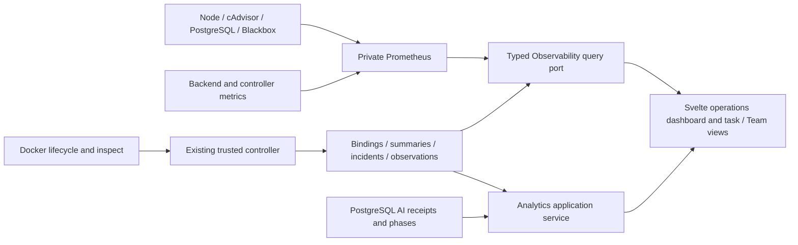

# Autonomous Engineering Worker V2.1: implementation architecture

This document maps the September 8, 2026 specification to the repository. It is an
implementation record, not a production acceptance certificate. The control plane,
execution plane and supporting observation plane have different failure boundaries.

## Control and execution

The fixed lifecycle remains in `engineering/domain/lifecycle.py`. Intake adapters
normalize and authorize external events; ambiguous messages use the bounded local
Interpreter with configured cloud fallbacks. `engineering/infrastructure/executor.py`
coordinates native Developer continuation, isolated deterministic validation and
delivery. Native harness state and AI receipts remain in `agent_runtime`; the
delivery context retains branch, PR, current-revision review and merge authority.
Supporting analytics cannot admit paid work, change budgets or merge code.

Repository runtime profiles are additive configuration in
`repository_runtime_profiles`. The repositories screen edits Developer and validator
image references and bounded argument arrays through the repository application
port. The phase executor uses the selected images, retaining the existing global
configuration as the fallback for repositories without profiles. Successful
validation records verification time; a digest is recorded when the reference is
already pinned. Images must be built on the worker host with the project tooling.
No network permission is added to validators to install missing dependencies.

Provider model selection and versioned price records remain operator configuration.
Prices in a design document are not automatically loaded into billing. This change
does not dispatch paid benchmark tickets or replace configured models.

## Observation data flow

`observability/domain/metrics.py` defines metric identifiers and request bounds.
`PrometheusQueryAdapter` translates those identifiers into fixed templates and
bounds timeout, concurrency, response bytes, cardinality and range points. It
caches common requests and returns unavailable/stale results on upstream errors.
It strips arbitrary labels and represents NaN and missing values as null.

The HTTP schema modules `interfaces/http/schemas/observability.py` and
`interfaces/http/schemas/analytics.py` validate public response shapes and expose
their contracts in OpenAPI. They do not introduce Pydantic into domain ports.

The optional Compose overlay adds private exporters, resource limits and bounded
TSDB retention. It preserves the application network when adding observability.
Only the trusted controller observes Docker; no Docker socket is added to backend,
frontend, Prometheus or Developer containers. cAdvisor remains trusted host
infrastructure with sensitive mounts. Public Caddy ingress blocks metrics and alert
ingestion. Standalone frontend previews proxy API requests through a fixed private
upstream; production Caddy still owns ingress authentication.

`DockerEventsAdapter` correlates event identities with native task/profile records,
deduplicates deliveries, records incidents, and finalizes runner summaries after
exit. Bounded Docker inspection recovers running containers after observer restarts
and persists allowlisted state, health, restarts and exit information. It does not
persist environment variables, commands or arbitrary Docker labels.

Raw samples stay in Prometheus. PostgreSQL retains identities, lifecycle evidence,
resource summaries, configuration and incidents. Coverage derives from unique
exporter observation timestamps; missing metrics or short lifetimes remain
incomplete. Linux production and Docker Desktop VM measurements are not equivalent.

## Analytics and forecasting

The analytics application reads execution facts through `AnalyticsFacts`; HTTP
routes depend on application protocols and composition functions. Framework and
database imports remain outside domain/application modules.

`efficiency.py` centralizes known/unknown cost, reservations, token categories,
Developer turns, compaction, review/validation counts and completed phase/wait
durations. Reasoning and cached input are identified as subsets. Merged tasks with
missing receipts are excluded from complete-cost efficiency. Agent success uses
participation in terminal tasks; cohorts can overlap after a profile change.
Engineering-time forecasts exclude human/review waits while retaining CI waits.
Provider outage/rate-limit waits are derived from recorded wait reasons; they are
not guessed from the difference between a harness wall clock and provider time.

The dashboard provides selected-window aggregates and separate 24h/7d/30d cost
totals, model/profile/repository/run-kind groups, daily cost and local Interpreter
receipts. The monthly gauge uses a calendar-month advisory target and does not
replace Team spending admission. Live runner cards join task receipt totals and
container resource usage; their cost is clearly task-to-date, not a fabricated
per-container invoice.

Statistical forecasts use earlier completed tasks and the repository/harness/model/
complexity, Team, and global fallback hierarchy. They return metric-specific sample
counts and confidence, P50/P75/P90, and observed extrema. Manual estimates and labels
participate in deterministic complexity grouping. Original forecast snapshots are
immutable; final actuals and accuracy evaluation are separate.

Queue cost/token/active-time estimates sum eligible task estimates. RAM scenarios
sum the largest predicted task peaks up to each Team's configured concurrency;
drain time assumes full available concurrency. These are advisory scenarios, not
calibrated joint percentiles or scheduling constraints. Period projections use
observed active-day spending/token quantiles; inactive calendar days are not silently
assumed to be zero. Sparse or incomplete history remains insufficient.

## Product views

- `OperationsDashboard`: CPU/RAM/monthly budget gauges, disk ring, host capacity and
  throughput, live resource table, forecasts, reliability and active runners.
- `ServiceResourceTable`: CPU cores/percent, RAM/limit, network, process/throttling,
  state/health/restarts, uptime and last seen. History is fetched on selection.
- `AnalyticsPanels`: daily cost, token mix, model/agent/repository/run-kind cost,
  agent efficiency and local Interpreter activity.
- `ForecastPanels`: queue/period projections and forecast accuracy.
- `ReliabilityPanel`: raw-probe uptime with coverage, availability history,
  incidents, scrape health and Docker lifecycle history.
- `RunnerResourceCard`: linked task, Developer/profile/model, receipt totals, wall
  and AI time, current resources and any retained peak.
- `FixedLifecycleCanvas`: immutable topology with shared live task/resource badges
  and explicit zero AI spend during review waits.
- `TaskResourceBreakdown` / `TaskUsageDetails`: runner CPU/RAM history, persisted
  network/disk/process summaries, individual AI receipts, phase/wait details,
  local calls and forecast-versus-actual tables.

The ECharts wrapper owns client-only initialization, resize/disposal, theme text
and reduced-motion handling, plus textual chart summaries. The dashboard and
canvas share one live snapshot poller per browser page; hidden tabs pause polling.
Analytics refresh more slowly and history is requested on demand. Lifecycle SSE
continues carrying lifecycle events rather than raw Prometheus samples.

## Operator configuration and migrations

`0002_observability_analytics` adds observation and forecast history.
`0003_operational_configuration` adds monitoring preferences, current container
observations and repository runtime profiles. Neither resets existing data.
Application rollback leaves supporting tables intact.

The monitoring form saves validated preferences and an audit record. Display
thresholds are exported as metrics for Prometheus alert rules. Collection and
forecast preferences can disable already-deployed background features. Enabling
infrastructure that is not installed, or changing Prometheus retention, still
requires a deployment restart; requested retention and effective deployment state
are distinguishable. Secrets and scrape target configuration stay operator-owned.

## Remaining production gates and deliberate deferrals

The implementation does not manufacture evidence for native SDK resume/compaction,
Linux isolation/cancellation, deployment-host backup restoration, 10–20 authorized
ticket outcomes or acceptable monitoring overhead. These gates require recorded
runs on the intended environment. Local collector startup and an unpaid synthetic
container do not satisfy the whole engineering benchmark.

Per-provider first-token/first-edit timing and unrecorded provider-wait duration require
reliable harness receipts; absent evidence is unavailable. Unknown resource classes
on Docker Desktop remain unavailable. Queue forecasts do not model CI/human delays
or resource admission, and forecast confidence is not statistically calibrated.
ML, automatic resource admission, OpenTelemetry, Grafana and long-term daily
rollups remain optional/later as specified. No paid forecasting loop is introduced.

See `v2.1-rollout.md` for the recorded local checks and deployment gates, and
`../monitoring/README.md` for private-stack setup.

## Single-database local deployment

The active application is now the normal `autonomous-engineering-worker` Compose
project. Its API, worker, analytics, configuration and observability records share
the `engineering_worker` PostgreSQL database. The old legacy and migration-test
databases and the separate acceptance stack/volumes were deleted with operator
authorization because their data was disposable. Existing native configuration was
consolidated into `.env`; no second application database is needed.

The Desktop overlay retains the collector's Docker mount and exposes the Linux
VM's root filesystem measurements. The browser uses same-origin API forwarding.
Production Linux uses the original host mounts and production ingress overlay.
